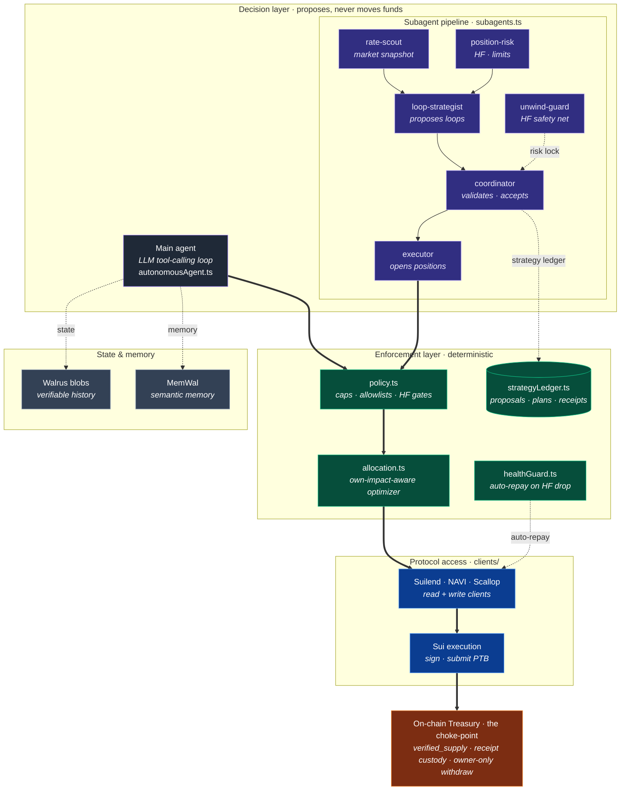
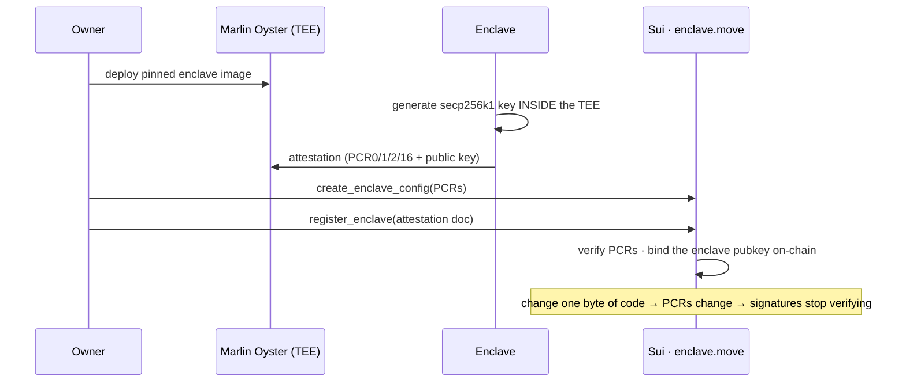
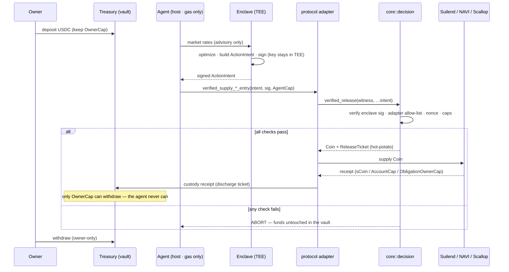

# HexLiquid Yield

A non-custodial multi-agent that deploys idle stablecoins under on-chain risk bounds you can
cryptographically verify. The LLM plans (one main agent + six independent subagents), a
decision layer runs strategies **inside a TEE** and explains; a deterministic layer moves
funds. Shared Walrus state and memory

## Highlights

- **Non-custodial by construction.** Funds live in an on-chain `Treasury<T>`; the agent holds
  only a capped, revocable `AgentCap` and can never withdraw. A **split architecture** —
  protocol-free `treasury_core` + one adapter package per protocol — keeps each protocol's
  dependencies isolated, and `verified_release` hands out a bounded `Coin` **plus a
  `ReleaseTicket` hot-potato** that can only be discharged by custodying the protocol receipt
  inside the vault. Funds can't escape, even across package boundaries.
- **The *decision* is attested, not just the signature.** A Nitro-based enclave on **Marlin
  Oyster** runs the optimizer and signs the allocation with a key generated **inside the TEE**;
  `register_enclave` binds that pubkey on-chain after verifying the attestation (PCR0/1/2/16).
  The agent sends only market data — it can't puppet the venue or amount.
- **Verified on-chain before any funds move.** Enclave signature → adapter allow-list →
  nonce/replay → caps → receipt custody; over-cap aborts, a **tampered intent is rejected**,
  only the owner withdraws. The `ActionIntent` BCS is byte-identical across `@mysten/sui` ≡
  Move ≡ enclave ≡ agent.
- **Live on Sui mainnet** across Suilend, NAVI (via `AccountCap`), and Scallop —
  `treasury_core` [`0x2e069f6b…`](https://suivision.xyz/package/0x2e069f6be4e68b6a533676122754ba9611898a431c1b0240dc4e0cc8d1cde3a4),
  attested [`Enclave<DECISION>` `0x1ee14a68…`](https://suivision.xyz/object/0x1ee14a68089b59872e66f77d5259e007d5b2a1c92ed93313f7dd99add848d108),
  per-protocol adapters. All ids in [`deployments/mainnet-v2.env`](deployments/mainnet-v2.env).

Full design: [`docs/treasury-agent-design.md`](docs/treasury-agent-design.md) · deploy +
attestation runbook: [`docs/deploy-runbook.md`](docs/deploy-runbook.md). ~130 tests across
Move + agent + enclave; live **Seal** is scaffolded (policy + wiring in place, key-load stubbed).

## Architecture

Two decision engines — an LLM main agent and a deterministic six-subagent pipeline — *propose*;
a deterministic enforcement layer gates every fund move; the on-chain Treasury is the
choke-point. Thick arrows are the fund path; dotted arrows are feedback, coordination, and
persistence.



Full component map: [`docs/architecture.md`](docs/architecture.md).

## How the attested flow works

**One-time: enclave attestation & registration.** The signing key is born inside the TEE and
bound on-chain, so only this exact code's signatures will ever verify.



**Runtime: the treasury-mode supply flow.** Funds live in the vault; the agent only relays an
enclave-signed allocation the contract verifies before releasing and custodying.



Deeper diagrams (Seal key-load, the full module map) are in
[`docs/treasury-agent-design.md`](docs/treasury-agent-design.md).

## Deployed on Sui mainnet

All ids are also in [`deployments/mainnet-v2.env`](deployments/mainnet-v2.env).

**Packages**

- treasury_core: https://suivision.xyz/package/0x2e069f6be4e68b6a533676122754ba9611898a431c1b0240dc4e0cc8d1cde3a4
- Enclave / Nautilus framework: https://suivision.xyz/package/0x9aa904f2d8e55626f4ba4d3c76fd48fb84f00e86f2bfd558980b1d6268828b8b
- Scallop adapter: https://suivision.xyz/package/0x308221b0a3f63a6a0cf4350e324a7765d29dc4f9bc4072d25b783ed3f5b20f68
- NAVI adapter: https://suivision.xyz/package/0x0de89081fb15e9dbce00246448a1e1a698f21fcb723d701f3da2d8c2429621b9
- Suilend adapter: https://suivision.xyz/package/0x2292d8d0c248a7b0246f33752e411064f88fe8575c959c1e86558436c1f55e45

**Objects**

- DecisionRegistry (adapter allow-list): https://suivision.xyz/object/0x77e41e19e5771984d3dd14f20bcadd8405baf549db995fa5ce8176520e876e29
- Enclave (attested signer): https://suivision.xyz/object/0x1ee14a68089b59872e66f77d5259e007d5b2a1c92ed93313f7dd99add848d108
- EnclaveConfig (pinned PCR0/1/2/16): https://suivision.xyz/object/0x46d15bf6bff64adeb9cb4815ade709004c22e16936cfb941eeede562264797c5
- Treasury (USDC vault): https://suivision.xyz/object/0x7442a82ad30bb67fb4944b0de95a31124b55c896e29f0436ebe3884096eac3aa

Live attested-supply tx: https://suivision.xyz/txblock/C5TAscXkvHhC67b8W26NaAvFWUi5gyg9gXacrZyfs8GG

## Layout

| Folder | What it is |
|---|---|
| [`agent/`](agent/) | Off-chain TypeScript agent (the "brain"): an LLM tool-calling loop **and** a six-subagent yield-looping pipeline, the own-impact-aware optimizer, policy, health guard, Suilend/NAVI/Scallop read+write clients, the attested `treasury` CLI, Walrus/MemWal memory. Self-contained Bun package. |
| [`move/`](move/) | On-chain Sui Move packages (the choke-point). Built, tested, **deployed on mainnet**: protocol-free `treasury_core` (scoped revocable `capability.move`, enclave-signature verifier `decision.move`, `verified_release` + `ReleaseTicket` custody, `seal_policy.move`) plus per-protocol adapter packages. |
| [`enclave/`](enclave/) | TEE app (Marlin Oyster / AWS Nitro) for the attested strategy + signer — built and deployed. |
| [`app/`](app/) | The **Trust Console** — a read-only Next.js dashboard (`@mysten/dapp-kit`) that surfaces the agent's state (subagent heartbeats, rates, positions, plans, receipts, memory) and renders the docs. |
| [`docs/`](docs/) | [`architecture.md`](docs/architecture.md) (what's built), [`strategies.md`](docs/strategies.md) (strategies + math), [`subagent-pipeline.md`](docs/subagent-pipeline.md) (the loop pipeline), [`autonomy.md`](docs/autonomy.md), [`treasury-agent-design.md`](docs/treasury-agent-design.md) (TEE-verified custody design), [`deploy-runbook.md`](docs/deploy-runbook.md) (mainnet deploy), [`deployment.md`](docs/deployment.md) (agent config). |

## Tech stack

**Sui**
- **Sui Move 2024** + the Sui framework — the on-chain `treasury_core` + per-protocol adapter packages
- [`@mysten/sui`](https://www.npmjs.com/package/@mysten/sui) — Sui TS SDK: PTB construction, BCS codec, signing (agent · enclave · frontend)
- [`@mysten/dapp-kit`](https://www.npmjs.com/package/@mysten/dapp-kit) — wallet connection + React hooks (Trust Console)
- **`0x2::nitro_attestation`** — Sui's native Nitro-attestation verifier, used by `register_enclave`
- **Sui CLI** — package publish + PTBs for deploy/registration

**TEE & attestation**
- **Nautilus** — Sui's framework for verifiable TEE compute; our `enclave.move` (the `Enclave` object · PCR-pinned `EnclaveConfig` · `register_enclave` over a Nitro attestation doc) follows the Nautilus pattern
- **Marlin Oyster** — confidential compute (AWS Nitro enclaves) hosting the optimizer + signer
- [`@noble/curves`](https://www.npmjs.com/package/@noble/curves) + [`@noble/hashes`](https://www.npmjs.com/package/@noble/hashes) — secp256k1 sign + hash **inside** the enclave (tiny dep surface → small, reproducible PCR)
- [`@mysten/seal`](https://www.npmjs.com/package/@mysten/seal) — Seal threshold encryption for the sealed key (scaffolded)

**DeFi protocols** (on-chain Move adapters + off-chain SDKs)
- **Suilend** — [`@suilend/sdk`](https://www.npmjs.com/package/@suilend/sdk) + `suilend/suilend` Move
- **NAVI** — [`@naviprotocol/lending`](https://www.npmjs.com/package/@naviprotocol/lending) (non-custodial via `AccountCap`)
- **Scallop** — [`@scallop-io/sui-scallop-sdk`](https://www.npmjs.com/package/@scallop-io/sui-scallop-sdk) + `scallop-io/sui-lending-protocol` Move
- **Pyth** — price feeds (oracle refresh for value-computing supply/withdraw)

**Storage & memory**
- **Walrus** — verifiable blob storage for agent state + run reports
- [`@mysten-incubation/memwal`](https://www.npmjs.com/package/@mysten-incubation/memwal) — Walrus-backed semantic memory

**Agent & tooling**
- **OpenAI** (gpt-5.x) / **Anthropic** (Claude) — dual LLM backend for the planning agent
- **Bun** (runtime · package manager · test runner) · **TypeScript** · **Biome** (lint/format)

**Frontend — the Trust Console** (`app/`)
- **Next.js** · **React** · **Tailwind CSS** · **@tanstack/react-query** · **react-markdown** + **remark-gfm** · **mermaid**

## Quick start

Run from the repo root — these delegate into `agent/` and `move/`:

```bash
bun run setup                        # install agent deps
cp agent/.env.example agent/.env     # set the LLM key + AGENT_SUI_PRIVATE_KEY
bun run doctor                       # config + key + RPC checks
bun run dev                          # one autonomous main-agent loop (run-once)

cd agent && bun run run:supervisor   # main agent + six-subagent loop pipeline

bun run typecheck && bun run check && bun run test   # agent gates
bun run move:build && bun run move:test              # on-chain packages
```

**Two decision engines, one enforcement layer.** A flexible LLM tool-calling agent and
a deterministic six-subagent pipeline (rate-scout · position-risk · loop-strategist ·
coordinator · executor · unwind-guard) both move funds only through the same policy,
caps, allowlists, and health-factor gates. The pipeline runs **single-depth USDC→SUI
yield loops** with no LLM in the fund-moving path. See
[`docs/subagent-pipeline.md`](docs/subagent-pipeline.md).

(Use `bun run <script>` from root, not bare `bun test`.) See [`agent/README.md`](agent/README.md)
for full agent docs and [`move/README.md`](move/README.md) for the on-chain packages.

## The live attested treasury flow (Sui mainnet)

Funds live in an on-chain `Treasury`; the agent can only relay an enclave-signed allocation
that the contract verifies before releasing and custodying. The `treasury` CLI drives it
(reads `deployments/mainnet-v2.env`; every write dry-runs unless `--submit`):

```bash
cd agent
bun run treasury attest                                  # TEE identity: signing key + on-chain PCRs
bun run treasury create --fund 20 --cap 500 --submit     # mint + fund a vault (caps enforced on-chain)
bun run treasury sync-env                                # point the agent at the new vault
bun run treasury status                                  # idle balance · caps · custodied positions

bun src/index.ts run-daemon                              # agent: enclave /decide → attested verified_supply → custody

bun run treasury withdraw --protocol navi --amount 20 --submit   # owner-only; the agent can never withdraw
```

The full deploy → attest → register process (publish packages, `oyster-cvm deploy`, decode
the `:1301` attestation, `register_enclave`, register the adapter allow-list) is in
[`docs/deploy-runbook.md`](docs/deploy-runbook.md), along with a no-hardware **localnet
smoke-test** for the package linkage.

What the run proves: enclave-signed action → on-chain signature verify → adapter allow-list
→ caps → receipt custodied in the Treasury; a tampered intent (same signature, changed
amount) is **rejected on-chain**; only the owner withdraws.
