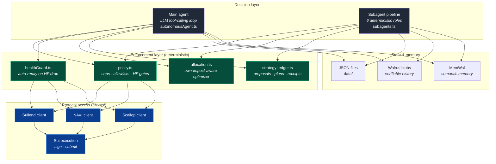

# Architecture

This document describes **what is built today** — a production multi-agent autonomous
system running live on Sui mainnet against Suilend, NAVI, and Scallop — and how it
relates to the on-chain Move package and the longer-term TEE-verified custody design.

> **Two layers, two maturities.**
> - The **off-chain system** (`agent/`) is in production: two decision engines read
>   and write on three lending protocols, route idle USDC with an own-impact-aware
>   optimizer, run a six-subagent yield-looping pipeline, and persist a verifiable
>   strategy ledger.
> - The **on-chain packages** (`move/packages/`) are **built and deployed live on Sui
>   mainnet** — a protocol-free `treasury_core` plus per-protocol adapter packages. The
>   receipt-custody upgrade (`verified_supply`) that makes fund movement fully
>   non-custodial is **done**: funds are released from the `Treasury` only against an
>   enclave signature and the protocol receipt is custodied back into the vault atomically,
>   across all three protocols (incl. NAVI via its `AccountCap`). See
>   [`treasury-agent-design.md`](treasury-agent-design.md) and `move/README.md`.

The system separates **autonomous decision-making** from **protocol access** and keeps
**all risk enforcement in deterministic code**, never in the model.

---

## 1. The big picture

There are **two decision engines** that share the same enforcement and access layers:

| Engine | What it is | Strength |
|---|---|---|
| **Main agent** (`autonomousAgent.ts`) | An OpenAI tool-calling loop. The model reads markets, positions, and memory, then calls bounded tools to supply/withdraw/borrow/repay and to allocate idle USDC. | Flexible, explainable, adapts to novel situations. |
| **Subagent pipeline** (`subagents.ts`) | Six deterministic roles that cooperate through a shared ledger to find, validate, execute, and guard **yield-looping** positions. | Predictable, auditable, no LLM in the fund-moving path. |

Both run under one process. The **supervisor** (`run-supervisor`) schedules the main
agent and the six subagents on independent intervals; you can also run any single
subagent or just the main agent alone. See
[`subagent-pipeline.md`](subagent-pipeline.md) for the pipeline in depth.

---

## 2. Layers

### `src/clients` — protocol access

Small clients grouped by kind. They shape requests/responses; they do **not** decide
whether an action is safe.

- **`chain/`**
  - `suiExecutionClient.ts` — Sui key handling, transaction signing and submission,
    RPC ping, wallet-match assertion.
  - `suilendClient.ts`, `naviClient.ts`, `scallopClient.ts` — one per lending
    protocol. **All three implement the same `LendingProtocolClient` interface**
    (`types.ts`): `getMarkets`, `getPositions`, `executeSupply`, `executeWithdraw`,
    `executeBorrow`, `executeRepay`, `simulateHealthFactorAfterBorrow`. This is what
    lets policy, the health guard, and the pipeline treat the protocols uniformly.
- **`http/`** — `openaiResponsesClient.ts` (Responses API via `fetch`, no SDK),
  `xClient.ts` (X/Twitter posting).
- **`storage/`** — `walrusBlobClient.ts` (raw verifiable blobs) and
  `walrusMemoryClient.ts` (MemWal semantic memory).

Each protocol's position is normalized into one shape (`NormalizedPositions`) so the
rest of the system never branches on protocol-specific details — except where a write
needs a protocol's receipt handle (Suilend: obligation + owner cap; Scallop:
obligation + key; NAVI: address-based, none).

### `src/core/allocation.ts` — the optimizer

An **own-impact-aware** allocation solver. Given idle USDC and each protocol's reserve
rate curve, it answers *"how should this be split across protocols to maximize yield,
accounting for the fact that my own deposit pushes the rate down?"*

- Models each market with a **kinked two-slope interest-rate curve** (the same shape
  Aave/Compound use): `supplyApr(u) = borrowApr(u) · u · (1 − reserveFactor)`.
- Solves `max Σ xᵢ·Rᵢ(xᵢ)` by **water-filling** — equalizing marginal supply rates
  across protocols — subject to per-protocol caps and a minimum position size.
- Returns concrete per-protocol supply legs for the main agent (via
  `get_optimal_allocation`) or the pipeline to execute.

See [`strategies.md`](strategies.md) §2 for the full derivation and solver.

### `src/core/policy.ts` — risk enforcement

The central gate. Every write action — `LENDING_SUPPLY`, `LENDING_WITHDRAW`,
`LENDING_BORROW`, `LENDING_REPAY` — must pass policy before it can execute. Checks
include `DRY_RUN`, per-action enable flags, amount caps, asset/protocol allowlists,
and borrow health-factor simulation. (Legacy `SUILEND_*` action types are still
accepted for back-compat.)

### `src/core/healthGuard.ts` — liquidation protection

Runs **before** the main LLM loop whenever borrows exist. If health factor drops
below `SUI_MIN_HEALTH_FACTOR`, it auto-repays the largest borrow (or records a planned
repay in dry-run). Works across all three protocols through the shared client
interface.

### `src/core/strategyLedger.ts` — the pipeline's shared state

A single-writer, file-locked JSON ledger (`data/strategy-ledger.json`) that holds the
entire state of the subagent pipeline: subagent heartbeats, market and position
snapshots, strategy proposals, accepted plans, execution receipts, loop positions, and
risk locks. Records are optionally archived to **Walrus** for verifiable history. It
prunes to bounded history and writes atomically (temp file + rename) under a lock.

### `src/core/agentMemory.ts` + `src/core/memoryStore.ts` — main-agent memory

`agentMemory` defines the persistent state shape (runs, position actions, tweets,
snapshots, pending tasks, artifacts) and pure read/update helpers. `memoryStore`
chooses where it lives: a local JSON file (`FileMemoryStore`) or verifiable Walrus
blobs with a local cache (`WalrusMemoryStore`), selected by `AGENT_MEMORY_BACKEND`.

### `src/core/toolRegistry.ts` — the main agent's tools

Defines the function tools exposed to the model and their local handlers. Every write
goes through policy and persists via the memory/ledger stores. See
[`autonomy.md`](autonomy.md) for the full tool list.

### `src/core/autonomousAgent.ts` — the main loop

Runs the OpenAI tool-calling loop: load memory → recall long-term context → run the
health guard → build the prompt → expose tools → execute tool calls locally →
finalize (archive a report blob, store a reflection). Returns an operational summary.

### `src/core/subagents.ts` — the pipeline

The six deterministic subagent roles and the loop-proposal builder, validator, and
executor. Covered in detail in [`subagent-pipeline.md`](subagent-pipeline.md).

### `src/index.ts` — the entry point / supervisor

Wires the clients and dispatches commands: `run-once`, `run-daemon` (main agent only),
`run-subagent <role>`, `run-supervisor` (everything), plus `doctor` and
`account:address`.

---

## 3. Strategies — what works today

> Full formulas and the optimizer math are in [`strategies.md`](strategies.md).

| Strategy | Engine | Status |
|---|---|---|
| **Idle-USDC allocation** (own-impact-aware split across protocols) | Main agent + `allocation.ts` | working |
| **Supply / withdraw / borrow / repay** on each protocol | Both | working |
| **Yield looping** (supply USDC → borrow SUI → re-supply SUI elsewhere) | Subagent pipeline | working, **single depth only** (`LOOP_MAX_DEPTH=1`) |
| **Auto-repay** when health factor drops | Health guard | working |
| Multi-depth recursive looping (depth > 1) | — | not supported (validator rejects) |
| Market-making, CLMM LP, cross-DEX arbitrage, liquidations | — | not built (future roadmap) |

The loop strategy is **hardwired to USDC collateral and SUI borrow** and requires the
SUI re-supply target to be a *different* protocol from the collateral protocol.

---

## 4. Protocols — integration status

All three are **fully integrated for reads and writes** through the shared
`LendingProtocolClient` interface.

| Protocol | SDK | Reads | Writes | Receipt model | Notes |
|---|---|---|---|---|---|
| **Suilend** | `@suilend/sdk` | | | `ObligationOwnerCap` (owned object) | First-class; obligation created on first supply. |
| **NAVI** | `@naviprotocol/lending` | | | `AccountCap` (owned object) | Non-custodial on-chain via the AccountCap path — the cap is custodied in the `Treasury`, so NAVI *is* in the non-custodial mode. |
| **Scallop** | `@scallop-io/sui-scallop-sdk` | | | obligation + key | Up to 5 sub-accounts per obligation. |

Each protocol is gated by two flags: `enabled` (reads) and `write`
(supply/withdraw/borrow/repay), plus membership in `SUI_ALLOWED_PROTOCOLS`.

---

## 5. The on-chain packages (`move/packages/`)

The choke-point that makes fund movement provably non-custodial — **built, tested, and
deployed live on Sui mainnet** as a split architecture: a protocol-free `treasury_core`
plus one adapter package per protocol (so no single package carries two protocols'
conflicting dependency graphs). See `move/README.md` and `move/packages/DEPLOY.md`.

- `core/capability.move` — `Treasury` + `OwnerCap` + `AgentCap`; per-tx and rolling-period
  caps, expiry, owner revocation, principal withdrawal, on-chain receipt events. The
  bounded release returns a `Coin<T>` **plus a `ReleaseTicket` hot-potato** that the
  caller is forced to discharge by custodying the protocol receipt — funds can never end
  up loose.
- `core/decision.move` — verifies the enclave signature over the canonical `ActionIntent`,
  checks an on-chain adapter allowlist (binds `protocol_id` → adapter witness, Cap-gated),
  enforces a strictly-increasing nonce, then performs the bounded `verified_release`.
- `core/seal_policy.move` — Seal gate (release key-shares only to the attested enclave).
- `enclave/` — registers the enclave's secp256k1 key bound to its PCR measurement
  (AWS Nitro attestation) and verifies signatures against it.
- `{scallop,navi,suilend,mock}_adapter/` — each depends on `core` + its one protocol's
  real published source; exposes `verified_supply_*_entry` (supply + custody) and
  `owner_redeem` (OwnerCap-gated unwind).

**`verified_supply` / receipt custody is done** — the released coin is supplied into the
protocol and its receipt (sCoin / `AccountCap` / `ObligationOwnerCap`) is custodied back
into the `Treasury` in one atomic transaction. Proven live across all three protocols via
the autonomous agent. Remaining roadmap: an on-chain bounds `verifier` (the off-chain
`policy.ts` port). See [`treasury-agent-design.md`](treasury-agent-design.md).

---

## 6. Execution safety rules

These hold across every write surface:

- **Never execute when `DRY_RUN=true`** (policy still records simulated/planned actions).
- **Per-action enable flags** are required (`ENABLE_SUI_POSITION_CREATION`,
  `SUI_ENABLE_BORROW`, `LOOP_EXECUTION_ENABLED`, …).
- **Amount caps** bound supply/borrow/repay and loop sizes.
- **Allowlisted assets and protocols only** (`SUI_ALLOWED_ASSETS`,
  `SUI_ALLOWED_PROTOCOLS`).
- **Minimum health factor** is enforced before borrows and continuously via the health
  guard; the pipeline adds a separate critical-HF unwind guard.
- **Every planned transaction is logged before signing.**

---

## 7. Branch layout

- **`base/fluid`** — frozen EVM/Fluid agent reference.
- **`main` / `feat/sui-native`** — Sui-native treasury agent (Suilend + NAVI + Scallop).
- **`multi-subagent-pipeline`** — adds the six-subagent yield-looping pipeline and the
  strategy ledger on top of the Sui-native agent.
