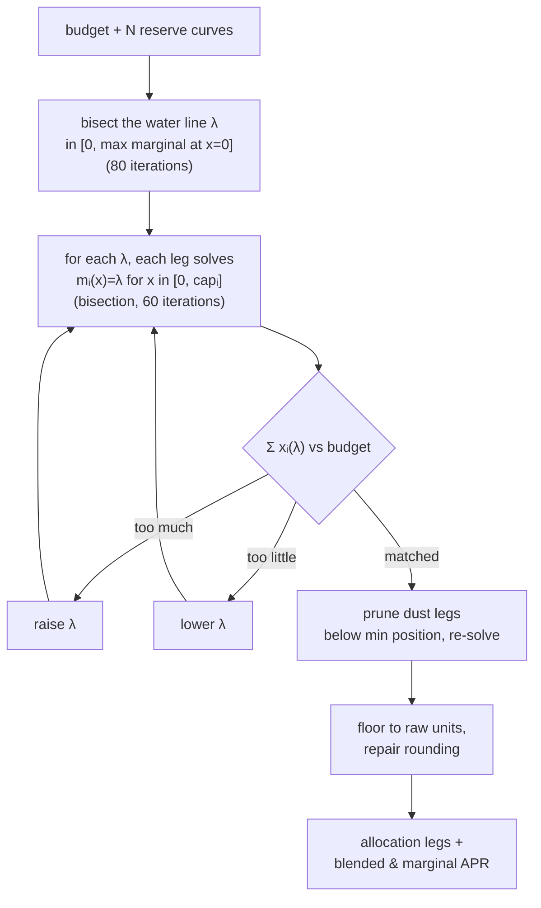

# Strategies & Math

This document is the precise specification of **what the agent decides and the math
behind it**. Every formula here is implemented in code and unit-tested; file
references are given so the doc and the source stay in lockstep.

| Strategy | Engine | Core module | Status |
|---|---|---|---|
| **Idle-USDC allocation** — own-impact-aware split across protocols | Main agent | `core/allocation.ts` | working |
| **Rebalancing** — move deployed capital only when it pays for itself | Main agent | `core/policy.ts` | working |
| **Yield looping** — supply USDC → borrow SUI → re-supply SUI elsewhere | Subagent pipeline | `core/subagents.ts` | working (single depth) |
| **Health-factor protection** — auto-repay / emergency unwind | Health guard + unwind-guard | `core/policy.ts`, `core/subagents.ts` | working |

All APRs in this doc are in **percent** (`5.0` = 5%). Utilization `u` is a fraction in
`[0,1]`. Amounts cross public boundaries as **raw integer strings** (token smallest
units) and are converted to float token-units only for rate math.

---

## 1. The interest-rate model

Every lending market is normalized into one **reserve curve**
(`ReserveCurve`, `allocation.ts:34`) so the solver is protocol-agnostic.

### 1.1 Borrow APR — piecewise-linear kinked curve

The borrow APR is a set of `(utilization, apr)` control points; the APR at any `u` is
**linear interpolation** between the two surrounding points
(`borrowApr`, `allocation.ts:95`). This is the standard Aave/Compound "two-slope kinked"
shape: gentle below the optimal-utilization kink, steep above it.

```
borrowApr(u) = lerp between control points surrounding u   (clamped to [first, last])
```

### 1.2 Supply APR from borrow APR

A supplier earns the borrow interest, scaled by how much of the pool is actually
borrowed (`u`) and net of the protocol's cut (the reserve factor)
(`supplyApr`, `allocation.ts:131`):

```
supplyApr(u) = borrowApr(u) · u · (1 − reserveFactor)
```

### 1.3 Own-impact: utilization falls as you deposit

The key insight that makes the optimizer non-trivial: **your own deposit lowers the
pool's utilization**, which lowers the rate you earn
(`utilizationAfterDeposit`, `allocation.ts:137`):

```
u(x) = borrowed / (borrowed + available + x)
```

So the **net supply APR of supplying `x`** (including any fixed reward/incentive APR)
is (`netSupplyApr`, `allocation.ts:155`):

```
R(x) = supplyApr( u(x) ) + rewardSupplyApr
```

`R(x)` is monotonically **decreasing** in `x` — the more you add, the less each marginal
dollar earns. That convexity is what the allocator exploits.

> **Simplification:** `rewardSupplyApr` is treated as fixed. A future version should
> decay it with the agent's share of the reward pool (incentives dilute as more capital
> farms them) — noted in `allocation.ts:152`.

### 1.4 Building the curve per protocol

| Protocol | Curve source |
|---|---|
| **Suilend** | Native reserve rate points read from the SDK, then validated. |
| **NAVI / Scallop** | Kink params converted to control points, then validated; falls back to a spot-anchored line if they don't reproduce the observed spot rate. |

Two guards keep mis-scaled SDK params from corrupting the math:

- **Reserve-factor derivation** (`deriveReserveFactorPct`, `allocation.ts:168`) — rather
  than trust a protocol's raw reserve-factor units, derive it from the spot
  relationship: `reserveFactor = clamp(1 − supplySpot / (borrowSpot · u), 0, 0.95)`.
- **Curve validation** (`validatedBorrowAprPoints`, `allocation.ts:206`) — accept the
  candidate control points only if they reproduce the observed spot borrow APR at the
  current utilization within tolerance `max(0.5, 15% · |spot|)`; otherwise use the
  **spot-anchored linear fallback** (`fallbackBorrowAprPoints`, `allocation.ts:187`): a
  line through the origin and `(u, borrowSpot)`. The fallback loses the kink but stays
  monotonic and directionally correct, so it still beats the naive heuristic.

---

## 2. Idle-USDC allocation — the water-filling optimizer

**Problem.** Given a budget of idle USDC and `N` reserve curves for that asset, split
the budget to **maximize total interest earned**, respecting per-leg caps
(`solveAllocation`, `allocation.ts:228`):

```
maximize    Σ xᵢ · Rᵢ(xᵢ)
subject to  Σ xᵢ = budget,   0 ≤ xᵢ ≤ capᵢ
```

Depositing into the single highest spot APR is **provably suboptimal**, because that
pool's rate falls as you fill it while a slightly-lower pool keeps paying.

### 2.1 The optimality condition

By the Lagrangian first-order condition, at the optimum the **marginal yield** of the
next dollar is **equal across every funded leg** — call that common level the *water
line* `λ`:

```
mᵢ(xᵢ) = d/dx [ x · Rᵢ(x) ] = Rᵢ(xᵢ) + xᵢ · Rᵢ′(xᵢ) = λ   for every funded leg i
```

Legs whose very first dollar earns less than `λ` get nothing; legs that would still
out-earn `λ` at their cap are filled to the cap.

### 2.2 How it's solved (water-filling)



- **Marginal yield** `mᵢ(x)` is computed by **central finite difference** of
  `interest(x) = x · R(x)` (`marginalYield`, `allocation.ts:390`), so it works for any
  piecewise-linear curve without hand-differentiating the interpolation.
- Because `Σ xᵢ(λ)` is **monotone decreasing in λ**, an outer **bisection** on `λ`
  (`waterFill`, `allocation.ts:320`, `LAMBDA_ITERATIONS = 80`) converges; each leg's
  `x(λ)` is found by an inner bisection (`solveMarginalEquals`, `allocation.ts:359`,
  `X_ITERATIONS = 60`).
- **Caps** per leg are `min(global per-protocol cap, protocol deposit cap, budget)`
  (`capFor`, `allocation.ts:256`). If `budget ≥ Σ caps`, every leg fills to its cap.

### 2.3 Cleanups that make the output safe to execute

- **Dust pruning** — legs funded below `minPositionRaw` are removed and the budget
  re-solved across the rest, so the agent never opens an economically pointless tiny
  position (only applied when ≥ 2 funded legs exist; a sub-minimum *single* leg is the
  "budget below min position" case and is kept).
- **Rounding repair** (`finalize`, `allocation.ts:423`) — flooring each leg to raw
  units can lose `< 1` unit per leg; a genuine rounding shortfall (`≤ legs` units) is
  pushed onto the largest leg, while a larger gap is a real cap-induced shortfall and
  stays reported as `unallocatedRaw` rather than breaching a cap.

### 2.4 Outputs

`AllocationResult` (`allocation.ts:67`) returns per-leg raw amounts and net supply APR,
the **blended net APR** (budget-weighted average across funded legs), the **marginal
APR** (the water line `λ`), and any `unallocatedRaw`. The main agent reaches this via
the `get_optimal_allocation` tool; `bun run verify:allocation` prints the live curves
and compares the optimal split against the naive top-rate heuristic.

---

## 3. Rebalancing — only move capital when it pays

Deploying *fresh* idle capital just uses §2. Moving *already-supplied* capital
(withdraw from A, supply to B) incurs an exit cost, so it needs a stricter gate.

### 3.1 Hysteresis floor

`shouldRebalance` (`policy.ts:148`) blocks APR-noise churn: a move is considered only if
the improvement clears a basis-point floor.

```
deltaBps = round( (candidateApr − currentApr) · 100 )
move only if deltaBps ≥ SUI_REBALANCE_MIN_APR_DELTA_BPS
```

### 3.2 Amortized breakeven

`evaluateRebalanceBreakeven` (`policy.ts:189`) generalizes the floor: the expected extra
yield over the holding horizon must exceed the round-trip execution cost.

```
expectedGainUsd = (targetNetApr − currentNetApr)/100 · amountUsd · (horizonDays / 365)
act  ⟺  deltaBps ≥ floor   AND   expectedGainUsd > costUsd
```

This is what makes "withdraw A → supply B" worth the gas; fresh deployment skips it
(no exit cost on the old leg).

---

## 4. Yield looping — leveraged carry

A **single-depth loop**: supply USDC as collateral, borrow SUI against it, and
re-supply that SUI to a *different* protocol. The position earns when the SUI supply
APR on the target exceeds the SUI borrow APR on the collateral protocol. Built and
validated in `subagents.ts` (proposal builders `:489`/`:579`, validator `:665`).

> **Hardwired:** collateral = USDC, borrow = SUI, depth = 1, target protocol ≠
> collateral protocol. The validator rejects anything else.

### 4.1 Profitability (net APR)

```
netAprBps = round( (targetSuiSupplyApr − collateralSuiBorrowApr) · 100 )
accept only if netAprBps ≥ LOOP_MIN_NET_APR_BPS
```

### 4.2 Sizing

**Fresh loop (`open_loop`)** uses the configured caps directly:

```
collateralUsd      = LOOP_MAX_COLLATERAL_USD
borrowUsd          = LOOP_MAX_BORROW_USD
rawCollateral      = floor( collateralUsd · 1e6 )           # USDC, 6 decimals
rawBorrow          = floor( (borrowUsd / suiPriceUsd) · 1e9 )  # SUI, 9 decimals
```

**Borrow against existing collateral** sizes the borrow to the **tightest** of three
limits (`plannedBorrowUsd`, `subagents.ts:862`):

```
capacityByFraction = (borrowLimitUsd − weightedBorrowsUsd) · LOOP_BORROW_CAPACITY_FRACTION
capacityByHealth   = borrowLimitUsd / LOOP_MIN_HEALTH_FACTOR − weightedBorrowsUsd
borrowUsd          = min( LOOP_MAX_BORROW_USD, capacityByFraction, capacityByHealth )
```

When a protocol doesn't expose borrow capacity before the first borrow, a conservative
fallback `effectiveBorrowLimitUsd = depositedUsd · 0.5` is used
(`subagents.ts:877`); live execution still re-checks projected HF where the protocol
client supports simulation.

### 4.3 Projected health factor

```
# open_loop (0.7 assumed USDC collateral LTV):
projectedBorrowLimit  = currentBorrowLimitUsd + collateralUsd · 0.7
projectedWeighted     = currentWeightedBorrowsUsd + borrowUsd
projectedHealthFactor = projectedBorrowLimit / projectedWeighted

# existing-collateral:
projectedHealthFactor = effectiveBorrowLimitUsd / (weightedBorrowsUsd + borrowUsd)

accept only if projectedHealthFactor ≥ LOOP_MIN_HEALTH_FACTOR
```

### 4.4 Validator checklist

`validateLoopProposal` (`subagents.ts:665`) is the deterministic gate (run at both
acceptance and execution — see [`subagent-pipeline.md`](subagent-pipeline.md) §4). It
requires: loop enabled; `LOOP_MAX_DEPTH = 1`; USDC/SUI only; borrow protocol =
collateral protocol; target ≠ collateral; not expired; projected HF ≥
`LOOP_MIN_HEALTH_FACTOR`; net APR ≥ `LOOP_MIN_NET_APR_BPS`; within `LOOP_MAX_BORROW_USD`
/ `LOOP_MAX_COLLATERAL_USD`; no active risk lock; no other active loop; snapshots fresh.

> **Honest caveat:** leverage lets the position *lose* money within bounds — a
> liquidation is an *authorized* outcome. The guarantees are about custody and blast
> radius, not strategy safety.

---

## 5. Health-factor protection

### 5.1 Convention

A uniform health-factor definition across all three protocols
(`types.ts:260`, computed in each client):

```
healthFactor = borrowLimitUsd / weightedBorrowsUsd        (∞ when no borrows)

borrowLimitUsd     = Σ depositUsdᵢ · openLtvᵢ
weightedBorrowsUsd = Σ borrowUsdⱼ · borrowWeightⱼ
```

Liquidation risk rises as HF approaches `1`, so a single floor (`SUI_MIN_HEALTH_FACTOR`)
applies everywhere. `simulateHealthFactorAfterBorrow` projects HF for a prospective
borrow (Suilend computes it locally as `borrowLimitUsd / (weighted + newWeighted)`;
NAVI/Scallop run SDK simulations).

### 5.2 Two guards

- **Health guard** (`evaluateHealthGuard`, `policy.ts:125`) — runs **before** the main
  LLM loop whenever borrows exist. If `healthFactor < SUI_MIN_HEALTH_FACTOR`, it
  auto-repays the largest borrow (or records a planned repay in dry-run).
- **Unwind-guard** (pipeline, `subagents.ts:440`) — every minute checks the latest
  position snapshot; if any borrowing position's `healthFactor ≤
  LOOP_CRITICAL_HEALTH_FACTOR`, it raises a critical **risk lock** (which blocks all new
  loop proposals) and flips active loops to `unwinding`.

Also enforced at borrow time: `policy.ts:100` **fails closed** if the projected HF is
`NaN`/unknown or below the floor.

---

## 6. Parameter → math reference

| Env var | Symbol / role | Default |
|---|---|---|
| `MIN_IDLE_USDC_RAW` | budget threshold to act | — |
| `SUI_MAX_SUPPLY_AMOUNT_RAW` | global per-leg supply cap | — |
| `SUI_REBALANCE_MIN_APR_DELTA_BPS` | rebalance hysteresis floor (§3.1) | — |
| `SUI_MIN_HEALTH_FACTOR` | health-guard floor & borrow floor (§5) | — |
| `LOOP_MIN_NET_APR_BPS` | min loop net APR (§4.1) | `100` |
| `LOOP_MIN_HEALTH_FACTOR` | min accepted projected HF (§4.3) | `1.75` |
| `LOOP_CRITICAL_HEALTH_FACTOR` | unwind-guard trigger (§5.2) | `1.45` |
| `LOOP_MAX_BORROW_USD` | loop borrow cap (§4.2) | `25` |
| `LOOP_MAX_COLLATERAL_USD` | fresh-loop collateral cap (§4.2) | `100` |
| `LOOP_BORROW_CAPACITY_FRACTION` | capacity fraction (§4.2) | `0.25` |
| `LOOP_MAX_DEPTH` | loop depth (must be `1`) | `1` |

Solver constants `LAMBDA_ITERATIONS = 80` and `X_ITERATIONS = 60` (`allocation.ts:89`)
set the bisection precision and are not env-configurable.

---

## 7. Not implemented

Out of scope today (no code path): market-making / DeepBook quoting, concentrated
liquidity (CLMM) LP, cross-DEX arbitrage, liquidation bots, multi-depth (`> 1`)
recursive leverage, and asset pairs other than USDC collateral / SUI borrow.

## 8. Tests

- `agent/test/allocation.test.ts` — curve evaluation, own-impact, water-filling vs
  naive, caps, dust pruning, rounding.
- `agent/test/policy.test.ts` — write gates, borrow HF floor.
- `agent/test/healthGuard.test.ts` — auto-repay trigger.
- `agent/test/strategyLedger.test.ts`, `agent/test/lendingRouter.test.ts` — loop
  proposal building, validation, and execution path.
