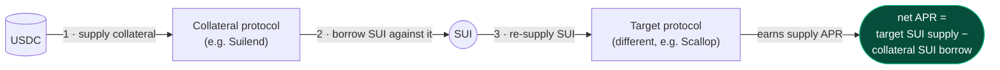
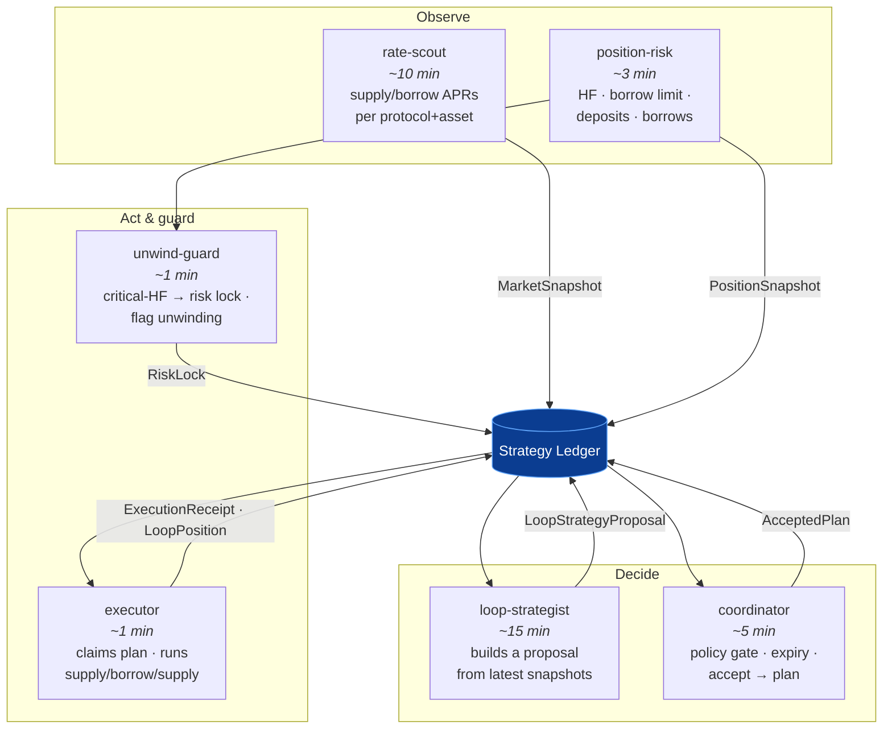
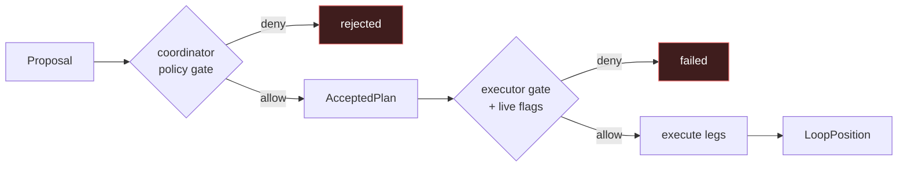

# Multi-Subagent Loop-Strategy Pipeline

> **In one sentence:** six small, single-purpose agents cooperate through one shared,
> append-style ledger to find, validate, execute, and guard a **yield-looping**
> position — with **no LLM in the fund-moving path** and every decision recorded for
> audit.

This is the deterministic counterpart to the LLM main agent. Where the main agent is
flexible and explainable, the pipeline is **predictable and auditable**: each role does
one thing, reads and writes a typed ledger, and leaves a heartbeat. Policy is checked
twice (at acceptance and again at execution), and a critical-health guard can freeze
new activity instantly.

- **Code:** `agent/src/core/subagents.ts`, `agent/src/core/strategyLedger.ts`
- **Entry points:** `bun run run:supervisor`, or `bun src/index.ts run-subagent <role>`
- **Tests:** `agent/test/strategyLedger.test.ts`, `agent/test/lendingRouter.test.ts`

---

## 1. The strategy it runs

A **single-depth yield loop**:



The loop is profitable when the SUI **supply** APR on the target protocol exceeds the
SUI **borrow** APR on the collateral protocol by at least `LOOP_MIN_NET_APR_BPS`. The
exact net-APR, sizing, and projected-health-factor formulas are in
[`strategies.md`](strategies.md) §4.

**Two proposal shapes** (`StrategyProposalType`):

| Type | What it does | When |
|---|---|---|
| `open_loop` | Fresh USDC supply → borrow SUI → re-supply SUI elsewhere | No existing USDC collateral, or `LOOP_USE_EXISTING_COLLATERAL=false` |
| `borrow_against_existing_collateral` | Skip the supply; borrow SUI against USDC you already deposited → re-supply elsewhere | You already hold USDC collateral (preferred when enabled) |

**Hard constraints** (enforced by the validator):

- Collateral asset = **USDC**, borrow asset = **SUI** (hardwired).
- Borrow protocol must equal the collateral protocol.
- SUI re-supply target must be a **different** protocol from the collateral protocol.
- `LOOP_MAX_DEPTH` must be **1** — multi-depth looping is rejected.
- Only **one** loop position (or loop-opening plan) may be active at a time.

---

## 2. The six roles



| Role | Default interval | Reads | Writes | Job |
|---|---|---|---|---|
| **rate-scout** | 10 min (`RATE_SCOUT_INTERVAL_MS`) | each protocol's markets | `MarketSnapshot` | Capture current USDC/SUI supply & borrow APRs and prices across enabled protocols. |
| **position-risk** | 3 min (`POSITION_RISK_INTERVAL_MS`) | each protocol's positions | `PositionSnapshot` | Capture health factor, borrow limit, weighted borrows, and deposit/borrow legs for the agent wallet. |
| **loop-strategist** | 15 min (`LOOP_STRATEGIST_INTERVAL_MS`) | latest snapshots | `LoopStrategyProposal` | Build the best available loop proposal (prefers existing-collateral); pre-validate and tag rejected if it fails policy. |
| **coordinator** | 5 min (`COORDINATOR_INTERVAL_MS`) | open proposals | `AcceptedPlan` | Expire stale proposals, warn on stale subagents, re-run the full policy gate, and promote **one** open proposal to an accepted plan (archived to Walrus). |
| **executor** | 1 min (`EXECUTOR_INTERVAL_MS`) | accepted plans | `ExecutionReceipt`, `LoopPosition` | Claim an accepted plan (TTL-guarded), re-check the executor gate, run the legs (planned in dry-run, on-chain when live), record digests and the resulting loop position. |
| **unwind-guard** | 1 min (`UNWIND_GUARD_INTERVAL_MS`) | latest position snapshot | `RiskLock` | If any borrowing position's HF ≤ `LOOP_CRITICAL_HEALTH_FACTOR`, raise a critical risk lock and flag active loops for unwinding. |

Every tick records a **heartbeat** (`running` → `ok`/`error`) so the coordinator can
detect a stalled role (`SUBAGENT_STALE_HEARTBEAT_MS`).

---

## 3. The lifecycle of one loop

```mermaid
sequenceDiagram
    participant RS as rate-scout
    participant PR as position-risk
    participant LS as loop-strategist
    participant CO as coordinator
    participant EX as executor
    participant L as Ledger
    participant Chain as Sui (live only)

    RS->>L: MarketSnapshot (USDC/SUI APRs)
    PR->>L: PositionSnapshot (HF, limits, legs)
    LS->>L: read latest snapshots
    LS->>L: LoopStrategyProposal (status: open)
    Note over LS: pre-validate; mark "rejected" if policy fails

    CO->>L: find one open proposal
    CO->>CO: validateLoopProposal (full policy gate)
    alt allowed
        CO->>L: proposal → accepted · AcceptedPlan (archived to Walrus)
    else denied
        CO->>L: proposal → rejected (reason)
    end

    EX->>L: claim AcceptedPlan (status → executing, claim TTL)
    EX->>EX: validateExecutorGate (re-check policy + live flags)
    alt dry-run
        EX->>L: legs = planned · LoopPosition (opening) · receipt (planned)
    else live
        EX->>Chain: supply USDC · borrow SUI · supply SUI
        Chain-->>EX: tx digests per leg
        EX->>L: legs = confirmed · LoopPosition (active) · receipt (confirmed)
    end
```

Status machines tracked in the ledger:

- **Proposal:** `open → accepted | rejected | expired`
- **Plan:** `accepted → executing → executed | failed | cancelled`
- **Loop position:** `opening → active → unwinding → closed`
- **Execution legs:** `planned | submitted → confirmed | failed`

---

## 4. Two-stage policy gate

Policy is enforced **twice** by the same `validateLoopProposal` rules, so a stale or
unsafe proposal can't slip through between acceptance and execution:

1. **At acceptance** (`coordinator`): loop enabled? depth = 1? USDC/SUI only? borrow
   protocol = collateral protocol, target ≠ collateral? not expired? projected HF ≥
   `LOOP_MIN_HEALTH_FACTOR`? net APR ≥ `LOOP_MIN_NET_APR_BPS`? within `LOOP_MAX_BORROW_USD`
   / `LOOP_MAX_COLLATERAL_USD`? no active risk lock? no other active loop? snapshots
   fresh (`LOOP_STALE_SNAPSHOT_MS`)?

2. **At execution** (`executor`, `validateExecutorGate`): re-runs the proposal policy
   **plus** the live-execution flags — in non-dry-run, both `SUI_ENABLE_BORROW` and
   `LOOP_EXECUTION_ENABLED` must be true.



The **executor claim** is TTL-guarded (`LOOP_EXECUTION_CLAIM_TTL_MS`): if a claimed
plan's executor dies mid-flight, the claim expires and another executor can safely
re-claim it. Receipt and plan updates are guarded by `claimedBy` + `executorRunId` so
two executors never double-write.

---

## 5. Concurrency & durability

The ledger is the single source of truth and the only writer surface:

- **File lock** — `strategy-ledger.json.lock` (mkdir/`wx` open) serializes every
  `update()`; a timeout surfaces a stuck lock.
- **Atomic writes** — write to a temp file, then `rename` over the ledger.
- **Bounded history** — snapshots/proposals/plans/receipts/locks/archives are pruned
  to fixed maxima on every save.
- **Verifiable archive** — accepted plans, execution receipts, and risk locks are
  optionally pushed to **Walrus** (`walrusArchives`) so the decision trail is
  independently verifiable.

This is why multiple subagents can run as independent timers in one process (or even
as separate `run-subagent` daemons) without corrupting state.

---

## 6. Running it

```bash
# Everything: main agent + all six subagents on their own intervals
bun run run:supervisor

# A single subagent loop (useful for debugging one role)
bun src/index.ts run-subagent rate-scout
bun src/index.ts run-subagent loop-strategist
# roles: coordinator | rate-scout | position-risk | loop-strategist | executor | unwind-guard
```

The **supervisor** bootstraps the subagents once in dependency order
(rate-scout → position-risk → loop-strategist → coordinator → executor →
unwind-guard) so the first cycle has fresh data, then schedules each role on its own
interval. The set of roles is configurable via `SUPERVISOR_ROLES` (include or omit
`main` to run the LLM agent alongside).

### Configuration

The pipeline is **off by default** — it observes and proposes only once enabled, and
executes on-chain only when both the dry-run and loop-execution flags are set.

| Variable | Default | Meaning |
|---|---|---|
| `LOOP_STRATEGY_ENABLED` | `false` | Master switch for the loop-strategist (build proposals). |
| `LOOP_EXECUTION_ENABLED` | `false` | Allow **live** loop execution (with `DRY_RUN=false` + `SUI_ENABLE_BORROW=true`). |
| `LOOP_COLLATERAL_ASSET` | `usdc` | Collateral asset (only `usdc` supported). |
| `LOOP_BORROW_ASSET` | `sui` | Borrow asset (only `sui` supported). |
| `LOOP_MAX_DEPTH` | `1` | Loop depth (only `1` supported). |
| `LOOP_MIN_HEALTH_FACTOR` | `1.75` | Minimum projected HF to accept a proposal. |
| `LOOP_CRITICAL_HEALTH_FACTOR` | `1.45` | HF at/below which the unwind-guard raises a risk lock. |
| `LOOP_MAX_BORROW_USD` | `25` | Max SUI borrow size (USD) per loop. |
| `LOOP_MAX_COLLATERAL_USD` | `100` | Max fresh USDC collateral (USD) per `open_loop`. |
| `LOOP_MIN_NET_APR_BPS` | `100` | Minimum net APR (bps) to open a loop. |
| `LOOP_USE_EXISTING_COLLATERAL` | `true` | Prefer borrowing against existing USDC collateral. |
| `LOOP_BORROW_CAPACITY_FRACTION` | `0.25` | Fraction of available borrow capacity to use (existing-collateral path). |
| `LOOP_PROPOSAL_TTL_MS` | `300000` | Proposal expiry (5 min). |
| `LOOP_STALE_SNAPSHOT_MS` | `600000` | Max acceptable snapshot age (10 min). |
| `LOOP_EXECUTION_CLAIM_TTL_MS` | `120000` | Executor claim timeout (2 min). |
| `SUBAGENT_STALE_HEARTBEAT_MS` | `600000` | Heartbeat age the coordinator warns on (10 min). |
| `RATE_SCOUT_INTERVAL_MS` | `600000` | rate-scout cadence. |
| `POSITION_RISK_INTERVAL_MS` | `180000` | position-risk cadence. |
| `LOOP_STRATEGIST_INTERVAL_MS` | `900000` | loop-strategist cadence. |
| `COORDINATOR_INTERVAL_MS` | `300000` | coordinator cadence. |
| `EXECUTOR_INTERVAL_MS` | `60000` | executor cadence. |
| `UNWIND_GUARD_INTERVAL_MS` | `60000` | unwind-guard cadence. |
| `SUPERVISOR_ROLES` | all seven | Which roles the supervisor runs (`main` + six subagents). |
| `STRATEGY_LEDGER_PATH` | `data/strategy-ledger.json` | Ledger file location. |

---

## 7. How the main agent and the pipeline interact

The main LLM agent can **read** the ledger and **drive** the pipeline through tools
(`get_strategy_ledger`, `propose_strategy_plan`, `claim_and_execute_strategy_plan`),
but it executes loops through the **same deterministic validator and executor** the
subagents use — the LLM never bypasses policy. `MAIN_AGENT_SUPPLY_WHEN_LOOP_ENABLED`
controls whether the main agent also does plain idle-USDC supply while the loop
strategy is enabled, so the two engines don't fight over the same funds.

---

## 8. Honest limitations

- **Single depth only.** Real leverage stacking (depth > 1) is intentionally rejected.
- **USDC/SUI only.** The asset pair is hardwired; other pairs need new code.
- **Off-chain custody today.** Live execution uses the agent wallet directly; the
  on-chain receipt-custody guarantee (`verified_supply`) is not yet built (see
  [`treasury-agent-design.md`](treasury-agent-design.md)). A leveraged position can
  still be **liquidated** — the guarantees are about custody, not strategy safety.
- **Input trust.** Snapshots come from protocol SDKs over the host's RPC; the pipeline
  bounds *blast radius* (caps, HF, single loop) but does not yet authenticate price
  inputs cryptographically.
