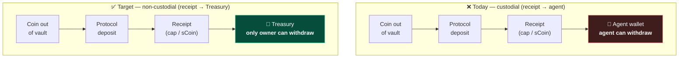
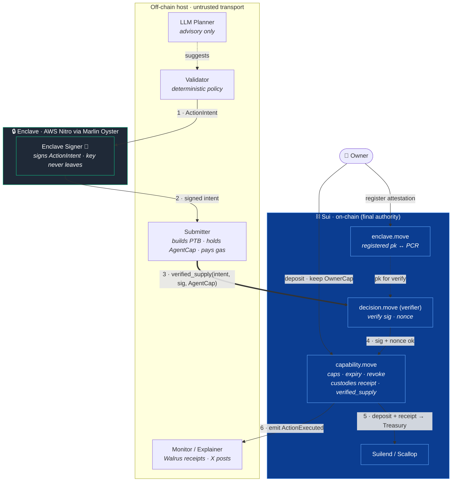
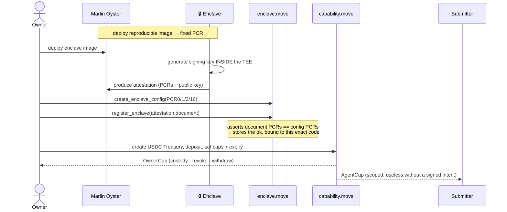
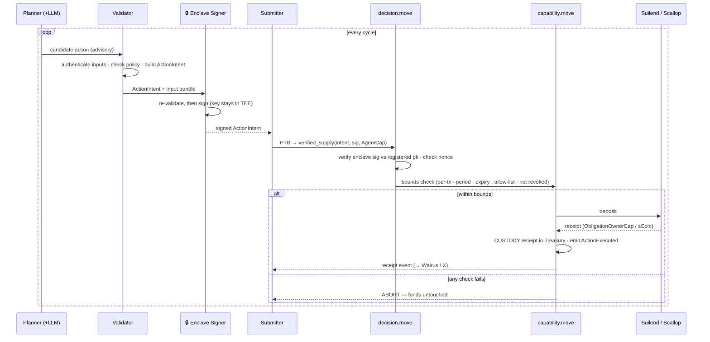
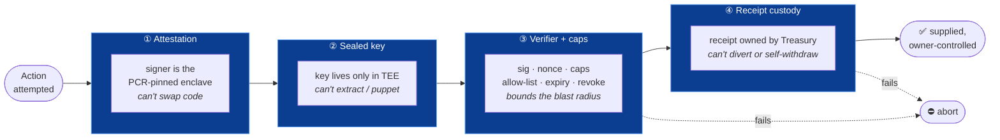
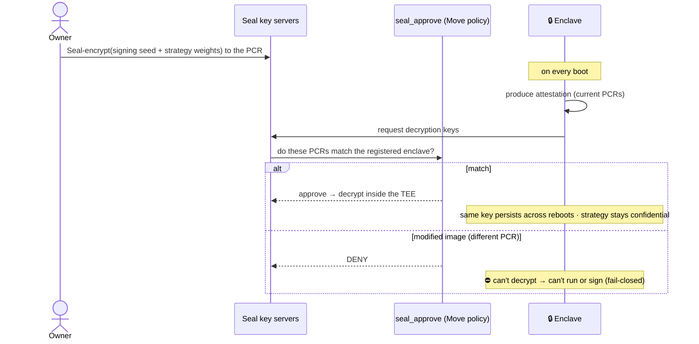
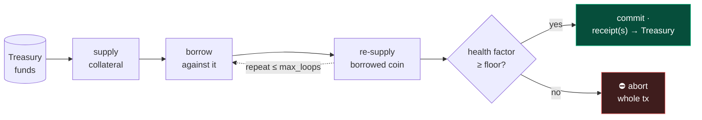
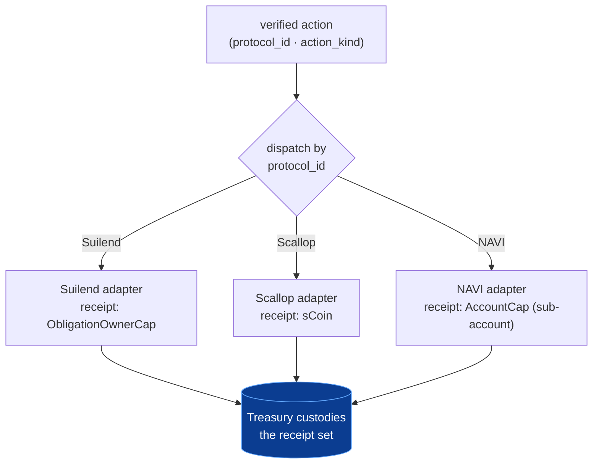

# Sealed-Key, Verifiably-Autonomous Treasury Agent — Design & Build Plan

> **In one sentence:** You deposit funds into a vault you still own, an AI agent
> earns yield on them autonomously, and it is *cryptographically unable* to steal
> them — because every move it makes is signed by tamper-proof hardware, re-checked
> on-chain against your limits, and leaves the deposit receipt locked inside your
> vault.

This document is the single source of truth. It reconciles two earlier drafts
(`treasury-agent-design.md` v2 and `tee-verified-treasury-architecture.md`) and
folds in what the current agent code actually does.

---

## 0. Why this exists

Letting an AI agent manage your money normally forces a bad trade: either you
hand it your private key (now it — and whoever runs it — can drain you), or you
approve every action yourself (now it isn't autonomous).

We remove the trade. The agent acts on its own, but it never holds custody. Four
independent guarantees make that true:

1. **It can only *propose*, not *move*.** The agent signs a request; the
   blockchain decides whether that request is allowed.
2. **You set hard limits on-chain.** Amount caps, an allow-list of protocols, an
   expiry, and replay protection — enforced by Move, not by the agent's good
   behavior.
3. **The deposited funds stay yours.** Every supply leaves its *receipt* locked
   inside your vault, so only you can ever withdraw.
4. **You can revoke instantly.** One transaction freezes the agent forever.

The rest of this document explains how each guarantee is built.

---

## 1. The mental model (read this first)

Three parties, and **none of them can move your funds alone:**


- The **agent** is authoritative over *intent* ("I want to supply 4 USDC to
  Suilend"). It is never authoritative over *funds*.
- The **Move verifier** is the final authority. It re-checks the agent's
  signature *and* your limits before anything moves.
- The **Treasury** keeps the proof-of-deposit (the "receipt"), so withdrawal
  always routes back to you.

Everything below is the engineering that makes this picture airtight.

---

## 2. Key terms

New to Sui or TEEs? These appear throughout.

| Term | What it means here |
|---|---|
| **TEE** | *Trusted Execution Environment* — a hardware-isolated region of a CPU. Code inside runs where the host machine can't read or tamper with it. We use **AWS Nitro**. |
| **Enclave** | A running TEE instance with our code loaded inside it. |
| **Attestation** | A signed certificate the enclave emits, proving *"this exact code is running, and here is my public key."* |
| **PCR** | *Platform Configuration Register* — a hash of the enclave's code/image. Same code → same PCR. Change one byte of code → different PCR. |
| **Marlin Oyster** | The service that hosts our Nitro enclave and exposes its attestation. |
| **Seal** | Sui's policy-gated encryption. It releases decryption keys *only* to a party that satisfies an on-chain Move rule (e.g., "your PCR matches the registered one"). |
| **Move** | Sui's smart-contract language. Our on-chain rules live here. |
| **PTB** | *Programmable Transaction Block* — Sui's way to chain several calls into one atomic transaction. |
| **BCS** | *Binary Canonical Serialization* — Sui's byte format. The enclave and Move must produce **identical bytes** to sign and verify the same message. |
| **Obligation / `ObligationOwnerCap`** | Suilend's lending position, plus the owned object that controls it. |
| **`sCoin`** | Scallop's fungible deposit receipt. |
| **`Treasury` / `OwnerCap` / `AgentCap`** | Our vault object, the owner's control capability, and the agent's scoped (limited) capability. |
| **`ActionIntent`** | The small, signed message describing one action the agent wants to take. |

---

## 3. The two claims we ship

Stated plainly, then proven in the sections that follow.

1. **Verifiable autonomy.** Every fund action is gated by an on-chain verifier
   that checks the enclave's signature, a nonce, your caps, the protocol
   allow-list, and an expiry *before* funds move. The chain holds *proof* the
   action stayed within your mandate — not a promise.

2. **A sealed-key agent you can't puppet.** The strategy and signing key live only
   inside an enclave whose code hash (PCR) is pinned on-chain. Swap the code → the
   PCR changes → its signatures stop verifying. With **Seal**, a modified image
   can't even decrypt its own key. Nobody — *including the operator* — can extract
   the key or substitute the strategy.

---

## 4. Execution model — the thin signer

**Design choice:** the enclave signs a tiny `ActionIntent` message. It does **not**
build or sign Sui transactions. A separate, untrusted **Submitter** does that, and
the chain re-verifies the enclave's signature.

Why split it this way? Because the enclave's code hash is the root of the whole
"can't puppet" claim — so the enclave must stay **small and auditable.** Keeping
the Sui SDK, gas handling, and network access *out* of the enclave keeps its image
minimal. As a bonus, **neither the host nor the enclave can move funds alone.**

> **Rejected alternative — "enclave = Sui wallet."** We considered letting the
> enclave hold a Sui key and sign full transactions. It simplifies the on-chain
> code, but it bloats the attested image (Sui SDK + gas + in-enclave networking)
> and quietly turns the TEE into the custodian. The on-chain plumbing was never
> the risk; the size and authority of the enclave were. So we rejected it.

### The four roles

The agent is one process today; it splits into four responsibilities, only one of
which is trusted.

| Role | Trust level | Job |
|---|---|---|
| **Planner** | untrusted | Reads markets; may use the LLM to summarize and propose. Output is advisory only. |
| **Validator** | deterministic | Checks allow-lists, caps, health, breakeven. Emits a typed `ActionIntent`. Mirrors the Move verifier's rules. |
| **Enclave Signer** | **trusted (attested)** | Re-validates the intent and signs it. The private key never leaves the TEE. |
| **Submitter** | untrusted | Builds the PTB, holds `AgentCap`, pays gas, submits. Cannot forge an intent or extract a key. |

*Current code lives in* `agent/src/core/allocation.ts`, `policy.ts`, and
`toolRegistry.ts`.

### Three authorities, none enough alone

The single most important property: **the enclave key is authoritative over
*intent*, never over *funds*.** Three separate authorities exist, and moving money
requires all the right pieces to line up.

| Authority | Held by | Can do | Cannot do |
|---|---|---|---|
| **OwnerCap** | you | custody, revoke, withdraw principal | — |
| **Enclave intent key** | inside the TEE | sign an `ActionIntent` ("this is allowed") | sign a Sui transaction; hold gas; be a tx sender; move funds |
| **Submitter + AgentCap + gas** | untrusted host | build/submit the PTB, pay gas | forge an intent; act without a valid enclave signature *and* Move approval |

The enclave intent key **is not a Sui wallet.** It is a registered secp256k1 key
that signs *only* the `ActionIntent` bytes. It never builds a transaction, never
pays gas, never appears as a sender. That is precisely what keeps the TEE out of
the custodian role:

> The enclave says *"allowed."* Move decides *"can actually move funds."* The
> Treasury keeps the receipt. You can revoke.

**One deliberate choice:** replay is blocked **on-chain** (a nonce in
`DecisionRegistry`), not by state stored inside the enclave. So even a rolled-back,
Seal-restored enclave cannot replay an old action — the chain remembers, the
enclave doesn't have to.

---

## 5. The core enforcement — receipt custody

This is the heart of the design, and the make-or-break engineering task.

**The insight:** a released coin flows *into* the protocol no matter what. So
"where does the coin go?" is the wrong question. The right question is **"who owns
the proof that the deposit happened?"** Whoever holds that receipt can withdraw.

### How each protocol hands back a receipt

We read the existing clients. The three protocols behave very differently — and
that difference decides which ones we can secure.

| Protocol | Supply call | Receipt it produces | Who can withdraw |
|---|---|---|---|
| **Suilend** | `depositIntoObligation(...)` | **`ObligationOwnerCap`** — an owned object | whoever holds the cap |
| **Scallop** (lending) | `client.deposit(...)` | **`sCoin`** — a fungible coin | whoever holds the sCoin |
| **NAVI** | `depositCoinPTB(tx, coin)` | **none** — credited to the sender address | whoever *is* that address |

### The invariant

> **The supply receipt — Suilend's `ObligationOwnerCap` or Scallop's `sCoin` —
> must be owned by the `Treasury`, not the agent.**

Today the agent sends every receipt to its own wallet. The fix is to route it into
the vault instead:



When the `Treasury` holds the receipt, the agent can **deposit** but only the
`OwnerCap` holder can **withdraw**. That is the non-custodial guarantee — and it is
genuinely enforceable for Suilend and Scallop.

**NAVI is out of scope for v1.** It ties the position to the *depositing address*,
with no transferable receipt. If the agent's address deposits, the agent's address
can withdraw — custodial by construction. (Its `AccountCap` sub-account model could
fix this later; the current code doesn't use it.)

### Current state vs. target — this is the bridge, not a polish step

The chain has **not yet crossed this bridge.** Today,
`decision.move::execute_decision` verifies the signature and nonce, then calls
`capability::release_for_action`, which returns a **raw `Coin<C>` into the PTB:**

```move
): Coin<C> {                                    // ← the host composes everything after this
    ...
    capability::release_for_action(treasury, cap, amount, clock, ctx)
}
```

While that coin is a free value in the PTB, the host can route it anywhere and send
the receipt to itself. So the planned `verified_supply` is **the central security
upgrade of the entire project,** not a downstream refinement. It must do the
protocol deposit *and* sink the receipt into the `Treasury` **inside one
Move-controlled action** — so neither the coin nor the receipt is ever
host-controllable.

> Everything else — Seal, the richer schema, the pitch — is secondary to proving
> this one path. **M0/M1 is make-or-break.**

---

## 6. How the modules map (so nobody rebuilds)

Our existing modules already implement the teammate doc's planned ones. This is a
naming reconcile, not a rebuild.

| Our module | Teammate doc name | Responsibility |
|---|---|---|
| `capability.move` | `capability.move` | Treasury, OwnerCap, AgentCap, caps, expiry, revoke **+ receipt custody + `verified_supply`** |
| `decision.move` | `verifier.move` | Verify the enclave signature over `ActionIntent`; nonce / replay protection |
| `enclave.move` | `attestation.move` / registry | Register enclave `pk` ↔ PCR; signature primitive |
| *(events in the above)* | `receipt.move` | `ActionExecuted` event, emitted only on success |

`decision.move` and `enclave.move` are **kept** — they are the thin-signer verifier
and the registry. Both are built and tested: 9 Move tests including real-signature
verification and replay/stale-nonce aborts, with BCS parity self-tested by the
enclave service on boot.

---

## 7. Component architecture — who talks to whom

Follow the numbered edges to trace one action.



**Read it as:** the enclave emits a signed instruction, the host is a dumb pipe,
the chain re-checks everything, and the vault keeps the receipt.

---

## 8. Setup & registration (one-time per deployment)



The key step is `register_enclave`: it **rejects any public key whose PCRs don't
match** the registered measurement. That single check is what makes the running
code un-swappable.

---

## 9. The runtime loop — one autonomous action, end to end



---

## 10. Defense in depth — four layers, no single point of trust

Each layer assumes the ones before it might fail.



The payoff: **even if the TEE itself were compromised** (defeating ① and ②), the
on-chain caps (③) still bound how much can move, and receipt custody (④) still
prevents the agent from ever redeeming to itself. And your `OwnerCap` revoke kills
every future action in one transaction.

---

## 11. Seal — completing the "can't puppet" guarantee (M4)

Attestation already stops a *swapped* image from producing valid signatures. Seal
closes the last gap: it stops a swapped image from even **starting.**



Without Seal, a per-boot key is un-extractable but ephemeral. With Seal, the key
and strategy weights are **persistent and confidential**, released only to the
exact attested image. Redeploy modified code and it fails closed.

**This is the live demo that sells the whole pitch:** change one line, redeploy,
and watch the agent refuse to act.

---

## 12. The signed message — `ActionIntent`

The enclave signs a typed, canonicalized message. (Adopted from the teammate doc;
richer than the original 3-field payload, because `policy_hash` and `input_hash`
are what give the signature *meaning* — a TEE attests code, not inputs.)

```text
ActionIntent {
  schema_version: u16,
  chain_id: vector<u8>,
  treasury_id: ID,
  agent_cap_id: ID,
  nonce: u64,
  expires_at_ms: u64,
  action_kind: u8,          // v1: supply_usdc | withdraw_to_treasury | emergency_unwind
  protocol_id: u8,
  asset_type: vector<u8>,
  amount: u64,
  min_health_factor_bps: u64,
  max_protocol_exposure: u64,
  policy_hash: vector<u8>,
  input_hash: vector<u8>,
  rationale_hash: vector<u8>,
}
```

### Migrating from the current payload

The built code signs a smaller message:

```text
DecisionPayload { treasury: ID, amount: u64, nonce: u64 }   // current — a walking skeleton
ActionIntent    { ...the 17 fields above... }               // target — the product schema
```

`DecisionPayload` proved the sign → verify → nonce path works. `ActionIntent` is
the real schema. Migrating means **one coordinated change in three places that must
stay byte-identical:**

1. the Move struct in `decision.move` (and its BCS field order),
2. the enclave's canonical serializer in `enclave/app/decision.ts`,
3. the boot self-test that asserts (1) and (2) produce the same bytes.

Do this **once, early, with a fixed test vector** — not field-by-field later.
`action_kind`, `protocol_id`, and `asset_type` are what let a single verifier gate
multiple action templates, so they're needed the moment M1 adds `verified_supply`.

### What `input_hash` proves (and what it doesn't)

`input_hash` proves **audit linkage** — "this signature is bound to *these* exact
inputs" — so no later report can claim the agent saw different data.

It does **not** prove the inputs were *correct*. A lying host can still feed bad
prices and get a valid signature over garbage. Input *correctness* requires the
enclave to **independently authenticate** its inputs — verify Pyth price
attestations or re-derive protocol state inside the TEE.

- **v1:** hash inputs for audit.
- **Production:** authenticate price and risk-relevant state in-enclave.

---

## 13. M0 — the spike that de-risks everything

Before writing `verified_supply`, answer one empirical question:

> **Which protocol lets our Move package deposit *and custody the receipt* most
> cleanly?** Concretely: can our package make the protocol's deposit call (a
> cross-package Move call) and end with the `ObligationOwnerCap` / `sCoin` owned by
> the `Treasury`, *without* the released coin ever being divertible by the host's
> PTB?

| Candidate | Receipt | Custody approach |
|---|---|---|
| **Suilend** | `ObligationOwnerCap` (owned object) | Treasury holds the cap. Open-source Move; we already consume its rate curve. |
| **Scallop** | `sCoin` (fungible) | Route the `sCoin` to the Treasury instead of the agent wallet. Simplest model. |

**Deliverable:** one chosen protocol + the exact deposit/withdraw call shape. NAVI
is excluded (address-bound, no transferable receipt).

---

## 14. Milestones

| # | Milestone | What it delivers |
|---|---|---|
| **M0** | Spike: Suilend vs Scallop deposit-and-custody-receipt; lock one protocol | de-risks the headline claim |
| **M1** | `capability.move`: custody the receipt + `verified_supply` for the chosen protocol; Move test **"agent can't withdraw to itself"** | the receipt-custody core of **#1 + #2** |
| **M2** | Mock `ActionIntent` signer → `decision.move` verify → Submitter PTB → tiny testnet flow (deposit → supply → receipt → revoke) | **#2** verified execution, end to end |
| **M3** | Real Oyster enclave + `register_enclave`; replace the mock signer | **#2** attested on-chain; **#1** can't-swap / can't-extract |
| **M4** | Seal-gated key + strategy weights (`seal_approve` releases only to the registered PCR) | completes **#1**: persistent, confidential, fail-closed |

---

## 15. Lanes — who builds what, in parallel

- **Lane A — `move/` (you):** `verified_supply` + receipt custody; the
  `register_enclave` ↔ verifier wiring; `seal_approve` (M4); tests.
- **Lane B — `agent/` (teammate):** split Planner / Validator / Submitter; build
  the deterministic `ActionIntent` from `allocation.ts` + `policy.ts`; route fund
  actions through the `Treasury` instead of `agent.walletAddress`.
- **Lane C — `enclave/` (you / shared):** `ActionIntent` canonical serialization +
  signer (already built for the 3-field payload — extend to the richer schema);
  deploy to Oyster; **M4: Seal provisioning.**
- **Joint:** the M0 spike, the `ActionIntent` schema, the deposit-and-custody call
  shape.

---

## 16. Risk controls

**v1 (required):** USDC-only treasury · protocol allow-list · asset allow-list ·
per-action cap · rolling-period cap · expiry · nonce / replay · owner revocation ·
no raw arbitrary transfers · receipt custody · on-chain receipts.

**v1.5:** max per-protocol exposure · depeg circuit breaker · protocol pause list ·
minimum health factor for any borrow-capable action · emergency unwind.

**Deferred:** live borrowing for user funds · recursive looping · CLMM LP ·
cross-asset swaps beyond approved stablecoin routing · NAVI (address-bound).
*(Forward path for leverage and these protocols: §20 Extensibility.)*

---

## 17. Tests

**Move.** create / deposit; supply within cap succeeds; reject over per-tx cap,
over rolling cap, expired, revoked, wrong treasury–cap pairing, replayed nonce,
wrong enclave signer, non-allow-listed protocol, non-allow-listed asset; **receipt
is Treasury-owned**; **agent can't withdraw to itself**; emit a receipt only on
success.

**Enclave / agent.** canonical intent, policy hash, and input hash are stable; a
tampered intent fails verification; the Planner can't produce an unsupported
`action_kind`; LLM output can't bypass the Validator; mock signer and enclave
signer share one interface.

**Integration (testnet).** USDC treasury creation; mock-signed supply into the
chosen protocol; receipt emitted and the Walrus report references its hash; revoke
blocks the next action; wrong signer / stale nonce / over-cap all fail; **M4:
redeploy a modified image → Seal denies → agent can't act.**

---

## 18. Non-goals (this hackathon)

Attested backtesting; borrowing or looping for user funds; multi-protocol verified
templates; NAVI; full on-chain Nitro certificate-chain verification (v1 verifies
attestation off-chain at registration and stores the pubkey on-chain); a pooled
multi-user share vault; a trust-console UI.

---

## 19. Open questions

1. **Attestation depth.** v1 verifies attestation off-chain and registers the
   pubkey on-chain; the hardened path verifies the full cert chain on-chain. Locked
   as v1; revisit for production (schema is unchanged either way). *(Leverage and
   protocol-coverage paths are detailed in §20 Extensibility.)*
2. **Vault shape.** Per-user `Treasury<USDC>` (locked for v1) vs. a pooled
   per-user-share vault (deferred product decision).
3. **First protocol.** Decided by the **M0 spike**.
4. **Deposit composition.** Cross-package Move deposit call vs. a PTB composed with
   a final on-chain assertion → resolved in M0. The cross-package call is preferred
   if feasible, because it keeps the coin out of host-controlled PTB space.
5. **Verifier scope.** How much of the risk check Move can re-derive from on-chain
   state vs. needing enclave-authenticated inputs → v1 hashes inputs for audit;
   production authenticates price and state in-enclave.

---

## 20. Extensibility — leverage & more protocols

Two questions decide whether this is a one-trick demo or a real platform: *can it
do leveraged strategies?* and *can it add protocols?* **Neither breaks the
architecture.** Both are deferred past v1 for honest, specific reasons — not
because the model can't express them. This section is the forward path.

### 20.1 Looping / leverage (supply → borrow → re-supply)

**Custody is not the new problem.** A leveraged loop is still *one* position — on
Suilend, one `Obligation`, hence one `ObligationOwnerCap`. The Treasury holds that
single cap; the entire loop happens *inside* that obligation; withdrawal stays
gated by the cap. So receipt custody covers leverage unchanged.

Leverage adds exactly two new requirements:

**(a) On-chain health enforcement becomes mandatory.** Supplying carries no
liquidation risk; borrowing does. So the verifier can no longer check only "amount
within cap" — it must read the obligation's resulting **health factor** and assert
it is ≥ `min_health_factor_bps` (a field the `ActionIntent` already carries). This
means Move must *re-derive* health from on-chain state, not trust the enclave's
number. That extra on-chain verification — not custody — is the real cost, and the
reason borrow-capable actions are gated behind it.

**(b) The loop must be one atomic action.** The borrowed coin can never become a
free PTB value (that would reopen the diversion hole `verified_supply` closes). So
a loop is a single new template — `verified_loop` (a new `action_kind`) — that does
supply → borrow → re-supply *inside one Move call*:



It also needs an **emergency-unwind / deleverage path** (owner-triggered, or a
permissionless keeper when health drops below the floor) — already listed as a
v1.5 control.

**The honest caveat (state it in the pitch):** leverage lets the agent *lose*
money within bounds — a liquidation is an *authorized* outcome. The crypto
guarantees are about **custody, not strategy safety**: the agent still cannot steal
your funds, but a leveraged position can be liquidated. The owner's protection
against bad leverage is the on-chain health floor + caps + revoke, not "no losses."

### 20.2 More protocols — the adapter pattern

Each protocol plugs in as an **adapter** behind one interface, dispatched by the
`protocol_id` already in the `ActionIntent` and the allow-list:

```text
deposit(funds)       -> receipt        // stored in the Treasury
withdraw(receipt)    -> funds          // gated by the custodied receipt
read_health(position)-> hf             // for borrow-capable actions
```



**The compatibility rule.** A protocol is non-custodial-compatible **iff it exposes
a transferable receipt or capability that gates withdrawal, which the Treasury can
hold:**

| Protocol | Receipt | Non-custodial? |
|---|---|---|
| Suilend | `ObligationOwnerCap` | ✅ Treasury holds the cap |
| Scallop | `sCoin` | ✅ Treasury holds the token |
| **NAVI** (default flow) | none — address-bound | ❌ as the current code uses it |
| **NAVI** (via `AccountCap`) | sub-account `AccountCap` | ✅ *if* we deposit under a Treasury-held `AccountCap` |

So **NAVI is supportable** — but only by switching from today's address-bound
deposit (`naviClient.ts`) to its `AccountCap` sub-account model, where the Treasury
custodies the `AccountCap`. The exact shape of that path needs confirming in a spike
before we promise it.

Two consequences:

- **Multi-protocol doesn't break custody.** The Treasury holds a *set* of receipts
  (dynamic fields keyed by position); withdrawal routes per-receipt.
- **Each adapter is a real per-protocol integration.** The strong "Move calls the
  protocol directly" path needs a cross-package Move dependency with callable entry
  functions. For protocols whose Move we can't cleanly import, the fallback is the
  PTB-composed-with-final-assertion path (§19 Q4): release → SDK composes the
  deposit directing the receipt to the Treasury → a final Move call asserts the
  Treasury now owns the expected receipt. Weaker, but it widens coverage.

### 20.3 Roadmap placement

| Capability | Stage | Gating work |
|---|---|---|
| Single-protocol supply (Suilend **or** Scallop) | **v1** | M0–M3 |
| Second supply protocol | v1.5 | one more adapter |
| NAVI support | v1.5 | `AccountCap` integration + spike |
| Looping / leverage | v2 | on-chain health enforcement + `verified_loop` + unwind keeper |
| CLMM LP, cross-asset routing | v2+ | new receipt types + price-impact bounds |

---

## 21. The pitch

- **Verifiable autonomy.** *"Every action is signed by attested hardware,
  re-verified on-chain, and bounded by your mandate. Proof, not trust."*
- **A sealed-key agent you can't puppet.** *"The strategy and key live inside
  attested code, and the receipt of every deposit is owned by your treasury — not
  the agent. Change the strategy and Seal won't hand over the key. Not even the
  operator can touch your funds."*
