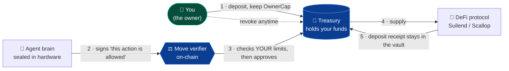
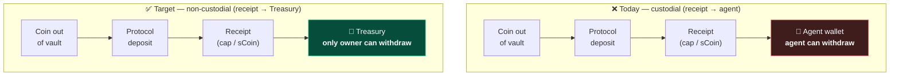
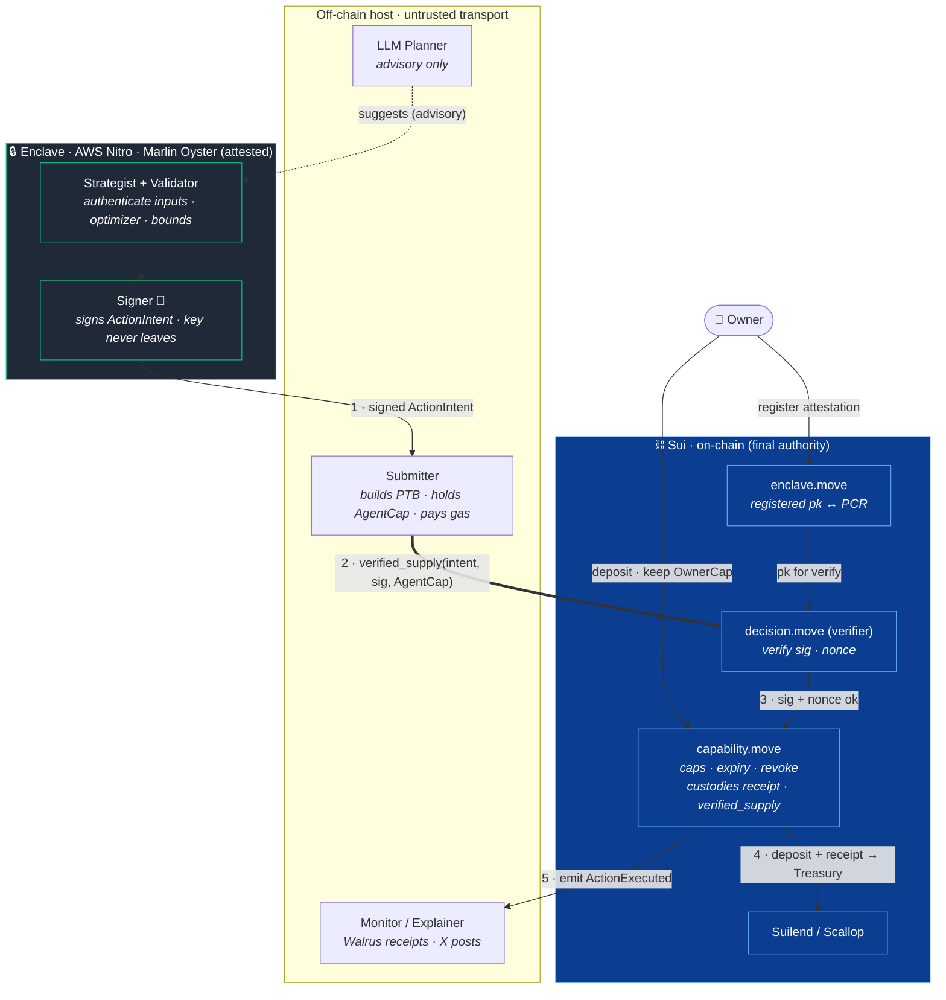
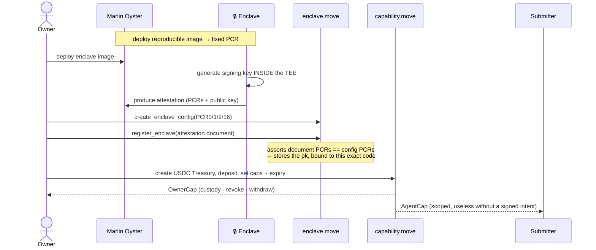
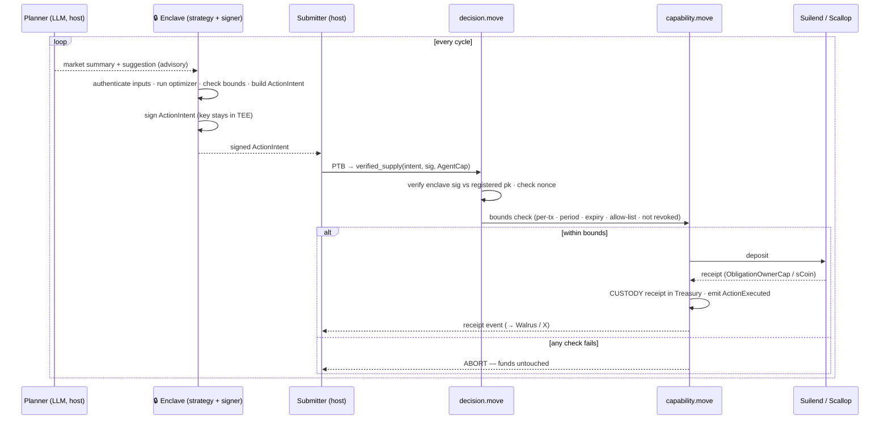
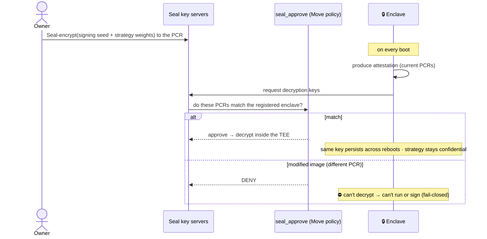
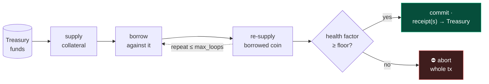
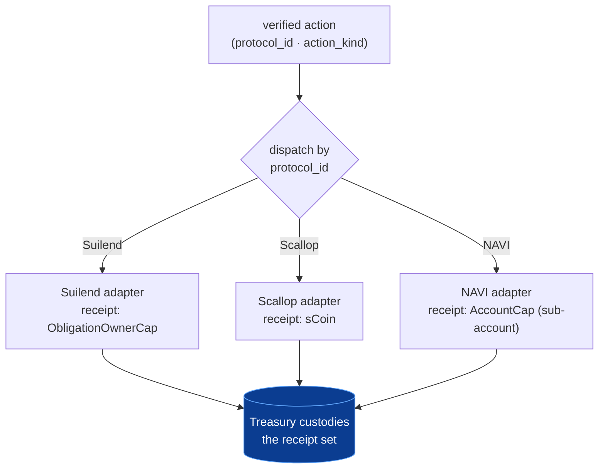

# Sealed-Key, Verifiably-Autonomous Treasury Agent

> **In one sentence:** you deposit funds into a vault you still own, an AI agent
> earns yield on them autonomously, and it is *cryptographically unable* to steal
> them — because every move is decided and signed inside tamper-proof hardware,
> re-checked on-chain against your limits, and leaves the deposit receipt locked
> inside your vault.

## Contents

**I · Concept** — [Why this exists](#1-why-this-exists) · [Mental model](#2-the-mental-model) · [The two claims](#3-the-two-claims) · [Key terms](#4-key-terms)
**II · Architecture** — [Thin signer](#5-execution-model-the-thin-signer) · [Receipt custody](#6-core-enforcement-receipt-custody) · [Modules & components](#7-modules-and-components) · [Setup](#8-setup-and-registration) · [Runtime loop](#9-the-runtime-loop) · [ActionIntent](#10-the-signed-message-actionintent)
**III · Security** — [Defense in depth](#11-defense-in-depth) · [Sealed key](#12-the-sealed-key-seal)
**IV · Build plan** — [M0 spike](#13-m0-the-de-risking-spike) · [Milestones](#14-milestones) · [Lanes](#15-lanes) · [Risk controls](#16-risk-controls) · [Tests](#17-tests)
**V · Beyond v1** — [Extensibility](#18-extensibility-leverage-and-protocols) · [Non-goals](#19-non-goals) · [Open questions](#20-open-questions) · [Pitch](#21-the-pitch)

---

# Part I · Concept

## 1. Why this exists

Letting an AI agent manage your money normally forces a bad trade: hand it your
private key (now it — and whoever runs it — can drain you), or approve every
action yourself (now it isn't autonomous).

We remove the trade. The agent acts on its own but never holds custody, because
four independent guarantees hold at once:

1. **It can only propose, not move.** The agent signs a request; the chain decides
   whether to allow it.
2. **You set hard limits on-chain.** Amount caps, a protocol allow-list, an expiry,
   and replay protection — enforced by Move, not by the agent's good behavior.
3. **The funds stay yours.** Every supply leaves its *receipt* locked in your vault,
   so only you can withdraw.
4. **You can revoke instantly.** One transaction freezes the agent forever.

## 2. The mental model

Three parties, and **none can move your funds alone:**



- The **agent** is authoritative over *intent*, never over *funds*.
- The **Move verifier** is the final authority — it re-checks the agent's signature
  and your limits before anything moves.
- The **Treasury** keeps the proof-of-deposit, so withdrawal always routes to you.

## 3. The two claims

1. **Verifiable autonomy.** Every fund action is gated by an on-chain verifier that
   checks the enclave's signature, a nonce, your caps, the allow-list, and an expiry
   *before* funds move. The chain holds proof the action stayed within your mandate.

2. **A sealed-key agent you can't puppet.** The strategy and signing key live only
   inside an enclave whose code hash (PCR) is pinned on-chain. Swap the code → the
   PCR changes → its signatures stop verifying; with Seal, a modified image can't
   even decrypt its key. Nobody — *including the operator* — can extract the key or
   substitute the strategy.

## 4. Key terms

| Term | Meaning here |
|---|---|
| **TEE** | *Trusted Execution Environment* — a hardware-isolated CPU region; code inside runs where the host can't read or tamper with it. We use **AWS Nitro**. |
| **Enclave** | A running TEE instance with our code inside. |
| **Attestation** | A signed certificate the enclave emits: *"this exact code is running, here is my public key."* |
| **PCR** | *Platform Configuration Register* — a hash of the enclave image. Same code → same PCR; one byte changed → different PCR. |
| **Marlin Oyster** | The service hosting our Nitro enclave and exposing its attestation. |
| **Seal** | Sui's policy-gated encryption — releases decryption keys only to a party satisfying an on-chain Move rule (e.g. "your PCR matches"). |
| **Move / PTB** | Sui's contract language; a *Programmable Transaction Block* chains calls into one atomic transaction. |
| **BCS** | *Binary Canonical Serialization* — Sui's byte format. Enclave and Move must produce **identical bytes** to sign and verify the same message. |
| **`ObligationOwnerCap` / `sCoin`** | Suilend's position-control object / Scallop's fungible deposit receipt. |
| **`Treasury` / `OwnerCap` / `AgentCap`** | The vault object, the owner's control capability, the agent's scoped capability. |
| **`ActionIntent`** | The small, signed message describing one action the agent wants to take. |

---

# Part II · Architecture

## 5. Execution model: the thin signer

The enclave is where the **decision is made and signed**: it authenticates inputs,
runs the deterministic strategy, validates the bounds, and signs a tiny
`ActionIntent`. It does **not** build or sign Sui transactions — an untrusted
**Submitter** does that, and the chain re-verifies the signature.

The line is **decision vs. transaction**, not "logic vs. no logic":

- **Inside the enclave** — input authentication, the deterministic optimizer (*the
  strategy*), bounds validation, signing. Pure computation; this keeps the
  *decision* attested, so "can't puppet the strategy" is real, not just
  "can't puppet the key."
- **Outside** — the advisory LLM, raw data fetching, and the Sui SDK / PTB / gas /
  submission. Keeping the *transaction machinery* out keeps the attested image small.

So the enclave's code hash covers the strategy and the key, but not the bulky Sui
tooling — and **neither the host nor the enclave can move funds alone.**

> **We rejected "enclave = Sui wallet."** Letting the enclave hold a Sui key and
> sign full transactions simplifies on-chain code but bloats the attested image
> (Sui SDK + gas + in-enclave networking) and turns the TEE into the custodian. The
> risk was never the on-chain plumbing; it was the size and authority of the enclave.

> **Caveat (see §10):** an attested optimizer only yields a trustworthy *decision*
> if its inputs are authenticated too. v1 attests the code and hashes inputs for
> audit; production also authenticates price/state in-enclave. Until then, the host
> can influence the decision through the data it feeds — but never exceed your
> on-chain bounds or touch custody.

### Four roles

Trusted roles run **inside** the enclave; untrusted ones on the host.

| Role | Runs | Job |
|---|---|---|
| **Planner** | host | Reads markets; may use the LLM to propose. *Advisory only.* |
| **Strategist + Validator** | **enclave** | Authenticates inputs, runs the optimizer, checks bounds (caps · allow-list · health), builds the `ActionIntent`. Mirrors the Move verifier. |
| **Signer** | **enclave** | Signs the `ActionIntent`; the private key never leaves the TEE. |
| **Submitter** | host | Builds the PTB, holds `AgentCap`, pays gas, submits. Cannot forge an intent or extract a key. |

### Three authorities, none enough alone

The enclave key is authoritative over *intent*, never over *funds*.

| Authority | Held by | Can do | Cannot do |
|---|---|---|---|
| **OwnerCap** | you | custody, revoke, withdraw principal | — |
| **Enclave intent key** | the TEE | sign an `ActionIntent` | sign a Sui tx · hold gas · be a sender · move funds |
| **Submitter + AgentCap + gas** | host | build/submit the PTB, pay gas | forge an intent · act without a valid signature *and* Move approval |

The enclave intent key **is not a Sui wallet** — it's a registered secp256k1 key
that signs only the `ActionIntent` bytes. That keeps the TEE out of the custodian
role: the enclave says *"allowed,"* Move decides *"can move funds,"* the Treasury
keeps the receipt, you can revoke.

Replay is blocked **on-chain** (a nonce in `DecisionRegistry`), not by enclave
state — so even a rolled-back, Seal-restored enclave cannot replay an old action.

## 6. Core enforcement: receipt custody

This is the heart of the design and the make-or-break task.

**The insight:** a released coin flows into the protocol regardless. So "where does
the coin go?" is the wrong question. The right one is **"who owns the proof the
deposit happened?"** — whoever holds that receipt can withdraw.

Each protocol hands back a different receipt:

| Protocol | Supply call | Receipt | Who can withdraw |
|---|---|---|---|
| **Suilend** | `depositIntoObligation(...)` | `ObligationOwnerCap` (owned object) | whoever holds the cap |
| **Scallop** (lending) | `client.deposit(...)` | `sCoin` (fungible) | whoever holds the sCoin |
| **NAVI** | `depositCoinPTB(tx, coin)` | none — credited to the sender address | whoever *is* that address |

**The invariant:**

> The supply receipt (`ObligationOwnerCap` / `sCoin`) must be owned by the
> `Treasury`, not the agent.



When the `Treasury` holds the receipt, the agent can **deposit** but only the
`OwnerCap` holder can **withdraw**. This is genuinely enforceable for Suilend and
Scallop. **NAVI is out for v1** — it binds the position to the depositing address
with no transferable receipt, so the agent's address could withdraw (its
`AccountCap` model could fix this later; see §18).

**The bridge we haven't crossed.** Today `decision.move::execute_decision` verifies
the signature and nonce, then returns a **raw `Coin<C>` into the PTB:**

```move
): Coin<C> {                          // ← the host composes everything after this
    capability::release_for_action(treasury, cap, amount, clock, ctx)
}
```

While that coin is a free PTB value, the host can route it anywhere and take the
receipt. So `verified_supply` — which performs the deposit *and* sinks the receipt
into the `Treasury` inside one Move action — is **the central security upgrade**,
not a refinement. Everything else (Seal, the richer schema, the pitch) is secondary
to proving this one path.

## 7. Modules and components

| Module | Responsibility | Status |
|---|---|---|
| `capability.move` | Treasury · OwnerCap · AgentCap · caps · expiry · revoke · **receipt custody · `verified_supply`** | to build (M1) |
| `decision.move` | verify enclave signature over `ActionIntent` · nonce / replay | **built + tested** |
| `enclave.move` | register enclave `pk` ↔ PCR · signature primitive | **built + tested** |

`decision.move` and `enclave.move` already pass 9 Move tests (real-signature verify,
replay/stale-nonce aborts), with BCS parity self-tested by the enclave on boot.

Trace one action through the system by the numbered edges:



The enclave *decides and signs*; the host is a dumb pipe that submits; the chain
re-checks everything; the vault keeps the receipt.

## 8. Setup and registration



`register_enclave` rejects any public key whose PCRs don't match the registered
measurement — the one check that makes the running code un-swappable.

## 9. The runtime loop



## 10. The signed message: ActionIntent

The enclave signs a typed, canonicalized message. `policy_hash` and `input_hash`
give the signature meaning — a TEE attests code, not inputs.

```text
ActionIntent {
  schema_version: u16,
  chain_id: vector<u8>,
  treasury_id: ID,
  agent_cap_id: ID,
  nonce: u64,
  expires_at_ms: u64,
  action_kind: u8,          // v1: supply_usdc | withdraw_to_treasury | emergency_unwind
  protocol_id: u8,
  asset_type: vector<u8>,
  amount: u64,
  min_health_factor_bps: u64,
  max_protocol_exposure: u64,
  policy_hash: vector<u8>,
  input_hash: vector<u8>,
  rationale_hash: vector<u8>,
}
```

**Migrating from the current payload.** The built code signs the smaller
`DecisionPayload { treasury, amount, nonce }` — a walking skeleton that proved the
sign → verify → nonce path. Adopting the full schema is one coordinated change that
must stay byte-identical across: (1) the Move struct + its BCS order, (2) the
enclave serializer in `enclave/app/decision.ts`, (3) the boot self-test asserting
(1) ≡ (2). Do it **once, early, with a fixed test vector** — `action_kind` /
`protocol_id` / `asset_type` are needed the moment M1 adds `verified_supply`.

**What `input_hash` proves.** Audit linkage — "this signature is bound to *these*
inputs" — so no later report can claim the agent saw different data. It does **not**
prove the inputs were correct; a lying host can sign over garbage. Correctness needs
the enclave to authenticate inputs (verify Pyth attestations / re-derive state
in-TEE). v1: hash for audit. Production: authenticate in-enclave.

---

# Part III · Security model

## 11. Defense in depth

Four layers, each assuming the ones before it might fail.


Even if the TEE were compromised (defeating ① and ②), the on-chain caps (③) bound
how much can move and receipt custody (④) keeps the agent from redeeming to itself.
The `OwnerCap` revoke kills every future action in one transaction.

## 12. The sealed key (Seal)

Attestation stops a swapped image from producing valid signatures. Seal stops a
swapped image from even **starting.**



Without Seal a per-boot key is un-extractable but ephemeral. With Seal the key and
strategy weights are persistent and confidential, released only to the exact
attested image. **The live demo that sells the pitch:** change one line, redeploy,
watch the agent refuse to act.

---

# Part IV · Build plan

## 13. M0: the de-risking spike

Before writing `verified_supply`, answer one empirical question:

> Which protocol lets our Move package make the deposit call (cross-package) and end
> with the `ObligationOwnerCap` / `sCoin` owned by the `Treasury` — without the
> released coin ever being divertible by the host's PTB?

| Candidate | Receipt | Custody approach |
|---|---|---|
| **Suilend** | `ObligationOwnerCap` | Treasury holds the cap. Open-source Move; we already consume its rate curve. |
| **Scallop** | `sCoin` | Route the `sCoin` to the Treasury, not the agent wallet. Simplest model. |

**Deliverable:** one chosen protocol + the exact deposit/withdraw call shape. NAVI
excluded (address-bound).

## 14. Milestones

| # | Milestone | Delivers |
|---|---|---|
| **M0** | Spike Suilend vs Scallop deposit-and-custody; lock one protocol | de-risks the headline claim |
| **M1** | `capability.move`: custody the receipt + `verified_supply`; test **"agent can't withdraw to itself"** | receipt-custody core of #1 + #2 |
| **M2** | Mock `ActionIntent` signer → `decision.move` verify → Submitter PTB → testnet flow (deposit → supply → receipt → revoke) | #2 verified execution, end to end |
| **M3** | Real Oyster enclave + `register_enclave`; move optimizer in; replace mock signer | #1 can't-swap / can't-extract; attested decision |
| **M4** | Seal-gated key + weights (`seal_approve` only to the registered PCR) | completes #1: persistent, confidential, fail-closed |

## 15. Lanes

- **Lane A — `move/`:** `verified_supply` + receipt custody; `register_enclave` ↔
  verifier wiring; `seal_approve` (M4); tests.
- **Lane B — `agent/`:** split host roles (LLM Planner + Submitter); expose the
  optimizer (`allocation.ts`) + policy (`policy.ts`) as **pure modules the enclave
  imports**; route fund actions through the `Treasury`, not `agent.walletAddress`.
- **Lane C — `enclave/`:** **move the optimizer + bounds into the enclave** (so the
  *decision* is attested); `ActionIntent` serialization + signer (extend the
  3-field skeleton to the full schema); deploy to Oyster; **M4: Seal provisioning.**
- **Joint:** the M0 spike, the `ActionIntent` schema, the deposit-and-custody call.

## 16. Risk controls

- **v1 (required):** USDC-only · protocol allow-list · asset allow-list · per-action
  cap · rolling-period cap · expiry · nonce/replay · owner revocation · no raw
  transfers · receipt custody · on-chain receipts.
- **v1.5:** max per-protocol exposure · depeg circuit breaker · protocol pause list
  · minimum health factor for borrow-capable actions · emergency unwind.
- **Deferred:** live borrowing · recursive looping · CLMM LP · cross-asset swaps ·
  NAVI. *(Forward path: §18.)*

## 17. Tests

- **Move.** create/deposit; supply within cap; reject over per-tx cap, over rolling
  cap, expired, revoked, wrong treasury–cap pair, replayed nonce, wrong signer,
  non-allow-listed protocol/asset; **receipt is Treasury-owned**; **agent can't
  withdraw to itself**; emit a receipt only on success.
- **Enclave / agent.** canonical intent + policy/input hashes are stable; tampered
  intent fails verification; Planner can't emit an unsupported `action_kind`; LLM
  can't bypass the Validator; mock and enclave signers share one interface.
- **Integration (testnet).** treasury creation; mock-signed supply; receipt emitted
  and the Walrus report references its hash; revoke blocks the next action; wrong
  signer / stale nonce / over-cap all fail; **M4: modified image → Seal denies →
  agent can't act.**

---

# Part V · Beyond v1

## 18. Extensibility: leverage and protocols

Two questions decide whether this is a one-trick demo or a platform: *can it run
leveraged strategies?* and *can it add protocols?* **Neither breaks the
architecture.**

### Looping / leverage (supply → borrow → re-supply)

Custody isn't the new problem — a loop is one position (one `Obligation`, one
`ObligationOwnerCap`), so receipt custody covers it unchanged. Leverage adds two
requirements:

1. **On-chain health enforcement.** Borrowing carries liquidation risk, so the
   verifier must read the resulting health factor and assert it's ≥
   `min_health_factor_bps` (already a field). Move must re-derive health from chain
   state, not trust the enclave — that extra check, not custody, is the real cost.
2. **One atomic action.** The borrowed coin can never be a free PTB value, so a loop
   is a single new template `verified_loop`:



Plus an emergency-unwind path (owner or a keeper when health drops). **Honest
caveat:** leverage lets the agent *lose* money within bounds — a liquidation is an
*authorized* outcome. The guarantees are about custody, not strategy safety: the
agent still can't steal, but a leveraged position can be liquidated.

### More protocols — the adapter pattern

Each protocol plugs in behind one interface, dispatched by `protocol_id`:

```text
deposit(funds)        -> receipt     // stored in the Treasury
withdraw(receipt)     -> funds       // gated by the custodied receipt
read_health(position) -> hf          // for borrow-capable actions
```



**Compatibility rule:** a protocol works **iff it exposes a transferable receipt or
capability that gates withdrawal, which the Treasury can hold.**

| Protocol | Receipt | Non-custodial? |
|---|---|---|
| Suilend | `ObligationOwnerCap` | ✅ |
| Scallop | `sCoin` | ✅ |
| NAVI (default) | none — address-bound | ❌ |
| NAVI (via `AccountCap`) | sub-account `AccountCap` | ✅ *if* deposited under a Treasury-held cap |

So **NAVI is supportable** via its `AccountCap` sub-account model (needs a spike to
confirm), just not its default flow. Two consequences: the Treasury holds a *set* of
receipts (dynamic fields), so multi-protocol doesn't break custody; and each adapter
is a real integration — a cross-package Move call where possible, else the
PTB-composed-with-final-assertion fallback (§20 Q4).

### Roadmap

| Capability | Stage | Gating work |
|---|---|---|
| Single-protocol supply | **v1** | M0–M3 |
| Second supply protocol | v1.5 | one more adapter |
| NAVI | v1.5 | `AccountCap` integration + spike |
| Looping / leverage | v2 | on-chain health + `verified_loop` + unwind keeper |
| CLMM LP, cross-asset | v2+ | new receipt types + price-impact bounds |

## 19. Non-goals

Attested backtesting; borrowing/looping for user funds; multi-protocol templates;
NAVI; full on-chain Nitro cert-chain verification (v1 verifies off-chain at
registration, stores the pubkey on-chain); a pooled multi-user share vault; a
trust-console UI.

## 20. Open questions

1. **Attestation depth.** v1 off-chain verify + on-chain pubkey; hardened path
   verifies the full cert chain on-chain (schema unchanged either way).
2. **Vault shape.** Per-user `Treasury<USDC>` (v1) vs. a pooled per-user-share vault.
3. **First protocol.** Decided by the M0 spike (§13).
4. **Deposit composition.** Cross-package Move deposit call vs. a PTB with a final
   on-chain assertion. The cross-package call is preferred — it keeps the coin out
   of host-controlled PTB space.
5. **Verifier scope.** How much risk-checking Move re-derives from chain state vs.
   needs enclave-authenticated inputs. v1 hashes for audit; production authenticates
   in-enclave.

## 21. The pitch

- **Verifiable autonomy.** *"Every action is decided and signed by attested
  hardware, re-verified on-chain, and bounded by your mandate. Proof, not trust."*
- **A sealed-key agent you can't puppet.** *"The strategy and key live inside
  attested code, and the receipt of every deposit is owned by your treasury — not
  the agent. Change the strategy and Seal won't hand over the key. Not even the
  operator can touch your funds."*
